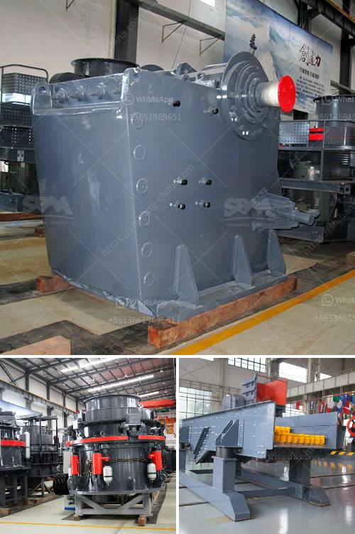

<h3>10 tph cone crusher price</h3>
The cone crusher, as a highly efficient crushing equipment, is widely used in metallurgical industry, building materials industry, road construction industry, chemical industry and silicate industry. It is suitable for crushing various ores and rocks with medium and medium hardness. According to the different crushing principle and product particle size, the cone crusher can be divided into many models. One of the popular models is the 10 tph cone crusher.

The 10 tph cone crusher is an often-used model in the small-scale crushing industry. It integrates coarse crushing and fine crushing, and has a simple structure, convenient operation and low running cost. It can be widely used in many industries such as metallurgy, construction, road construction, chemical and silicate.

When purchasing a 10 tph cone crusher, the price is an important factor for customers to consider. The price of the cone crusher varies with the model, specifications and output capacity. For example, the price of a 10 tph cone crusher with a capacity of 60-80 tons per hour is around $9,000-$10,000.

The higher the output capacity, the more expensive the price of the cone crusher. If the output capacity is not high, the price of the cone crusher is relatively affordable. On the contrary, if the output capacity is high, the price of the cone crusher will be higher.

In addition to the output capacity, the specification of the cone crusher also affects the price. Different specifications of cone crushers have different prices. For example, the price of a standard cone crusher is higher than that of a short head cone crusher.

The quality of the cone crusher also affects its price. A high-quality cone crusher will be more expensive. In addition, the brand of the cone crusher also affects its price. The cone crusher produced by well-known brands has stable performance, high efficiency and long service life, which will be reflected in its price.

In summary, the price of a 10 tph cone crusher varies with the model, specifications, output capacity, quality and brand. Customers should carefully consider their actual production needs and budget, and choose a cost-effective cone crusher.

When purchasing a cone crusher, it is recommended to choose a reliable manufacturer with a good reputation. A reliable manufacturer can provide customers with high-quality cone crushers, reasonable prices and perfect after-sales service, ensuring the smooth operation of the production line and maximizing economic benefits.
<h3>Contact us</h3><ul><li><strong>Whatsapp:&nbsp;<a href="https://wa.me/8613661969651">+8613661969651</a></strong></li><li><a href="https://swt.shibang-china.com/?git&amp;zhl&amp;10 tph cone crusher price"><strong>Online Service(chat now)</strong></a></li></ul><h3>Related</h3><ul><li><a href='machinery for magnesium extracted from dolomite.md'>machinery for magnesium extracted from dolomite</a></li><li><a href='contact list of stone crusher companies in south africa.md'>contact list of stone crusher companies in south africa</a></li><li><a href='iron ore heavy duty equipments with photos.md'>iron ore heavy duty equipments with photos</a></li><li><a href='complete crushing plant.md'>complete crushing plant</a></li><li><a href='limestone gypsum crusher machine.md'>limestone gypsum crusher machine</a></li></ul>