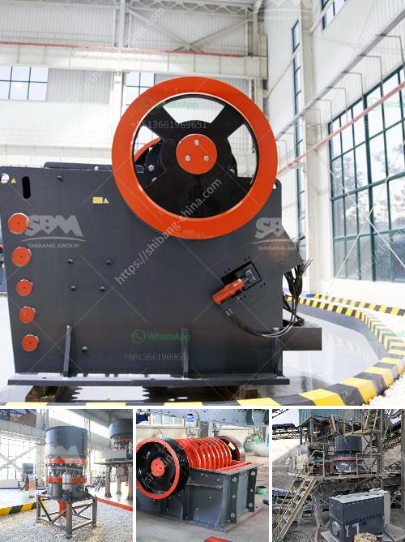

<h3>100 ton hour crushing</h3>
Crushing rocks, stones, and other materials at high volumes and efficiency is a crucial task in various industries such as mining, construction, and demolition. With advancements in technology and machinery, crushing operations have become faster and more efficient than ever before. One such example is the 100-ton per hour crushing process.

The process of crushing involves breaking down large rocks into smaller, more manageable sizes. This is achieved through the use of heavy-duty machinery and equipment specifically designed for crushing purposes. The 100-ton per hour crushing process is a popular choice among companies with high production demands, as it ensures a significant output within a short timeframe.

To achieve the desired 100-ton per hour crushing capacity, companies typically employ modern crushers that are capable of handling large quantities of material. These crushers often use mechanisms such as jaw crushers or impact crushers, which effectively reduce the size of the rocks by applying pressure or impact force. In addition to crushers, other equipment such as screens, conveyors, and feeders are also utilized to facilitate a smooth and continuous crushing process.

One of the key factors that contribute to the success of 100-ton per hour crushing operations is the proper selection of machinery and equipment. Companies need to carefully consider factors such as the type and hardness of the material being crushed, the desired end product size, and the specific requirements of the project. These considerations help in determining the most appropriate crushers and equipment for the job, ensuring optimal performance and minimal downtime.

Another essential aspect of the 100-ton per hour crushing process is maintenance and upkeep. Regular inspection, servicing, and replacement of worn-out parts or components are crucial to keep the crushing machinery operating efficiently. Ensuring that the equipment is in top condition helps companies avoid unexpected breakdowns, which can lead to costly production delays.

The 100-ton per hour crushing process offers several advantages to companies. Firstly, it allows for high production volumes, ensuring that project deadlines are met and customer demands are satisfied. Additionally, the process allows for efficient utilization of resources, as it maximizes the use of machinery and equipment. This, in turn, helps in minimizing operational costs and increasing profitability.

In conclusion, the 100-ton per hour crushing process is a significant part of various industries and plays a crucial role in meeting production demands effectively. With the right machinery, equipment, and maintenance practices, companies can achieve high levels of productivity, minimize downtime, and ensure consistent and reliable output. As technology continues to advance, the crushing process is expected to become even more efficient, offering improved results and greater cost savings for companies worldwide.
<h3>Contact us</h3><ul><li><strong>Whatsapp:&nbsp;<a href="https://wa.me/8613661969651">+8613661969651</a></strong></li><li><a href="https://swt.shibang-china.com/?git&amp;zhl&amp;100 ton hour crushing"><strong>Online Service(chat now)</strong></a></li></ul><h3>Related</h3><ul><li><a href='buy gold crusher machine.md'>buy gold crusher machine</a></li><li><a href='complete crusher plant for sale.md'>complete crusher plant for sale</a></li><li><a href='mineral pulverising ball mill manufacturer in india.md'>mineral pulverising ball mill manufacturer in india</a></li><li><a href='mtw trapezium mill.md'>mtw trapezium mill</a></li><li><a href='crusher factory in kenya.md'>crusher factory in kenya</a></li></ul>