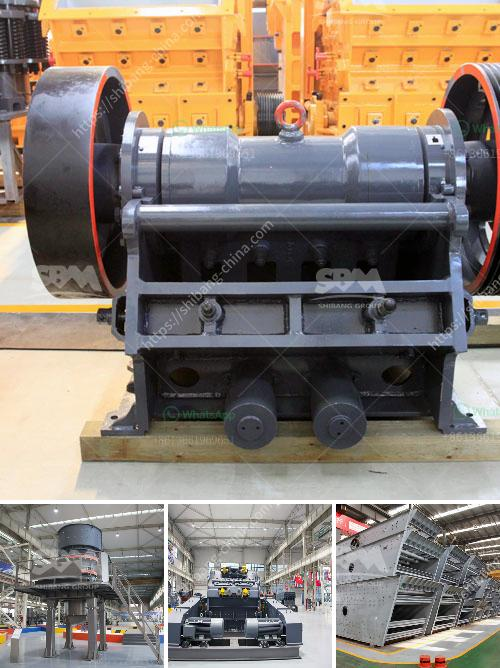

<h3>100 tph stone crusher plant specifications</h3>
The 100 tph stone crusher plant is the most commonly used and widely used equipment in the production of construction goods. The 100 tph stone crusher plant not only improves the production capacity and crushing efficiency, but also widens the application range. The hardness of the crushed materials produced by the 100 tph stone crusher plant is lower than that other crushing equipment. To our knowledge, the 100 tph stone crusher plant in the world has now expanded to a large range of applications, including the cement industry, construction materials production, and the mining industry.

Output size: The final output size can be adjusted to meet different production needs. Typically, the output size can range from 10mm to 40mm.

Heavy-duty machine structure: The machine structure is made of heavy-duty steel plates, ensuring durability and long service life.

Integrated control system: The plant is equipped with an integrated control system for smooth and efficient operation. The system allows for easy operation and monitoring of the crushing process.

Highly efficient motor: The plant is equipped with a highly efficient motor that ensures high performance and low energy consumption.

Low maintenance: The 100 tph stone crusher plant requires minimal maintenance and upkeep to ensure its smooth operation.

Easy installation: The installation process of the plant is simple and straightforward, requiring minimal time and effort.

Environmentally friendly: The 100 tph stone crusher plant is designed to have a minimal impact on the environment. It operates with low noise and dust emissions, which helps to create a clean and healthy working environment.

Wide application: The 100 tph stone crusher plant is suitable for crushing hard and medium-hard rocks and ores, including iron ore, copper ore, limestone, quartz, granite, basalt, diabase, etc. It is widely used in the construction industry, mining industry, and metallurgical industry.

Cost-effective: The 100 tph stone crusher plant is not expensive compared to other crusher plants. It has the characteristics of low cost and wide application.

In conclusion, the 100 tph stone crusher plant specifications and requirements are not only the important factors to consider when buying the crusher plant, but also necessary for the people who want to start a 100 tph stone crusher plant business. Next, the article will introduce the installation process and performance of the 100 tph stone crusher plant, hoping to provide you with some useful guidance to this end.
<h3>Contact us</h3><ul><li><strong>Whatsapp:&nbsp;<a href="https://wa.me/8613661969651">+8613661969651</a></strong></li><li><a href="https://swt.shibang-china.com/?git&amp;zhl&amp;100 tph stone crusher plant specifications"><strong>Online Service(chat now)</strong></a></li></ul><h3>Related</h3><ul><li><a href='belt conveyor design procedure.md'>belt conveyor design procedure</a></li><li><a href='sand and gravel mining equipment for sale.md'>sand and gravel mining equipment for sale</a></li><li><a href='jaw crusher indonesia agent.md'>jaw crusher indonesia agent</a></li><li><a href='stone crusher plant cost in saudi.md'>stone crusher plant cost in saudi</a></li><li><a href='gold mining equipment manufacturers.md'>gold mining equipment manufacturers</a></li></ul>