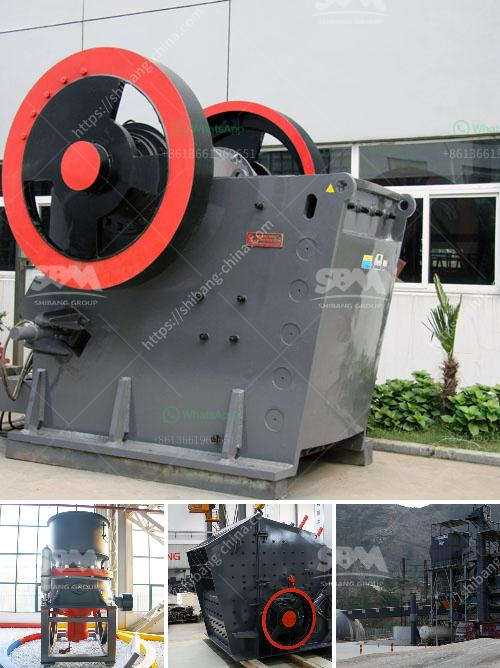

<h3>100 tph stone crusher price</h3>
The demand for crushed stone is on the rise, as construction projects continue to soar. One of the best options for crushing stone is the hydraulic cone crusher. Suitable for a variety of materials, the hydraulic cone crusher not only improves the production capacity and crushing efficiency, but also expands the range of applications. Although the price of 100 tph stone crusher is relatively high, users should choose a professional and reliable mining equipment manufacturer when purchasing equipment. The price comparison of 100 tph stone crusher is as follows:

Customers with tight budget can go directly to the appropriate column on the Internet to get free consultation, factory price and other details in seconds. Our experts analyze the specific needs of customers based on their budgets, and we have determined several types of 100 tph stone crushers for our customers to choose from. Please keep in mind that the price of crushed stone is not fixed and may vary depending on factors such as production capacity, geological conditions, market demand, etc.

Users who buy a 100 tph stone crusher should make a trial run first. This is because regular maintenance and repair will make the equipment last longer. In turn, the running costs will be lower, and the returned money will be more. Therefore, users must buy from a professional manufacturer when purchasing a 100 tph stone crusher. Manufacturers with good reputation and quality assurance must have higher prices, which means that the overall price of the equipment is relatively high.

There are many manufacturers of 100 tph stone crushers in the market. The prices of different types of stone crushers are different. In some cases, a single device may not be able to complete the entire crushing work, so the customer also needs a complete production line. In most cases, the investment cost of the project is relatively large and requires a larger return on investment. After a comprehensive comparison, the customer finally chose Dawning Heavy Industry Co., Ltd. as our supplier. The 100 tph stone crusher price is as follows:

What does the 100 tph stone crusher price mean? The price fluctuation of 100 tph stone crusher is mainly due to the change in the cost of raw materials and accessories in the production process. As the proper use of machines and various maintenance technologies and tools become more and more mature, the price of 100 tph stone crusher slows down. 

The overall price of the 100 tph stone crusher will fluctuate according to market conditions and other factors, and nothing can be ruled out at any time. Given the current macroeconomic uncertainties, investor sentiment is cautiously optimistic about the 100 tph stone crusher. Though larger, it is still an investment project worth giving a try as it has good returns in the long run.
<h3>Contact us</h3><ul><li><strong>Whatsapp:&nbsp;<a href="https://wa.me/8613661969651">+8613661969651</a></strong></li><li><a href="https://swt.shibang-china.com/?git&amp;zhl&amp;100 tph stone crusher price"><strong>Online Service(chat now)</strong></a></li></ul><h3>Related</h3><ul><li><a href='roller mill compontes.md'>roller mill compontes</a></li><li><a href='cobble crusher supplier.md'>cobble crusher supplier</a></li><li><a href='flowchart of a stone crushing plant.md'>flowchart of a stone crushing plant</a></li><li><a href='price of grinder machine in pakistan.md'>price of grinder machine in pakistan</a></li><li><a href='iron crushing plant in mexico.md'>iron crushing plant in mexico</a></li></ul>