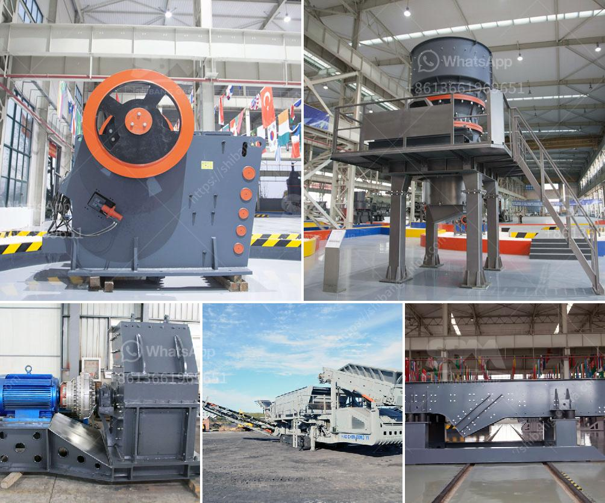

<h3>100tpd gold processing plant</h3>
A 100tpd gold processing plant is significant in its ability to recover valuable metals efficiently and effectively. Such a plant can efficiently process materials with high levels of sulfide and refractory ores to produce high-quality concentrates suitable for further refining. Moreover, this plant uses modern technology to maximize gold recovery rates while minimizing environmental impact.

One key aspect of a 100tpd gold processing plant is its capability to crush, grind, and process ore samples to release gold particles from embedded minerals. This is achieved through a combination of mechanical and chemical processes, such as grinding, leaching, and carbon-in-pulp (CIP). These processes convert the gold-bearing ore into a concentrated form that can be further processed to obtain the pure metal.

The 100tpd gold processing plant typically consists of several stages. Initially, the ore is crushed and ground into a fine powder, enabling the release of gold particles. Subsequently, the ore is mixed with a water-based solution containing chemicals to dissolve gold from the host minerals. This leaching process helps separate gold from other impurities.

Once the gold is dissolved, it is absorbed onto activated carbon particles (CIP process). The gold-loaded carbon is then removed from the system and placed in an elution vessel, where it undergoes thermal treatment to remove the adsorbed gold. This process, known as stripping, produces a concentrated gold solution.

The gold solution obtained from stripping is further treated to remove impurities and obtain pure gold. This is achieved through a series of electrochemical processes, including electrowinning and smelting. These processes result in the production of a high-quality gold product suitable for various applications, including jewelry, electronics, and investment purposes.

In conclusion, a 100tpd gold processing plant is a valuable asset in the mining industry as it allows for efficient recovery of gold from ores with high levels of sulfide and refractory minerals. By employing modern technology and efficient processes, such a plant can produce high-quality gold concentrates that can be further refined to obtain pure gold.
<h3>Contact us</h3><ul><li><strong>Whatsapp:&nbsp;<a href="https://wa.me/8613661969651">+8613661969651</a></strong></li><li><a href="https://swt.shibang-china.com/?git&amp;zhl&amp;100tpd gold processing plant"><strong>Online Service(chat now)</strong></a></li></ul><h3>Related</h3><ul><li><a href='alluvial wash plants in south africa.md'>alluvial wash plants in south africa</a></li><li><a href='equipment for quarry.md'>equipment for quarry</a></li><li><a href='roller crusher for sale gumtree.md'>roller crusher for sale gumtree</a></li><li><a href='processing of platinum ore flow sheet.md'>processing of platinum ore flow sheet</a></li><li><a href='beneficiation small scale tin ore processing plant.md'>beneficiation small scale tin ore processing plant</a></li></ul>