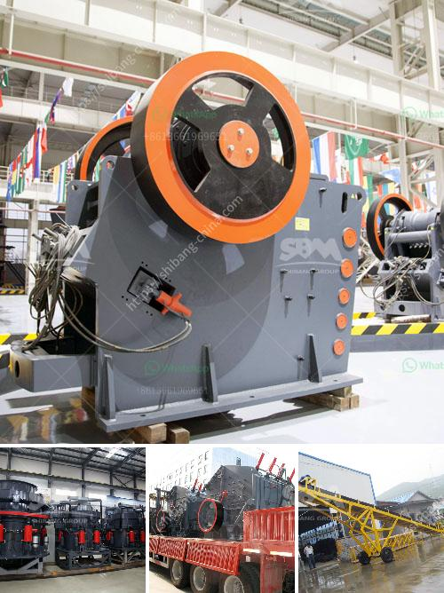

<h3>100tph small capacity granite crusher</h3>
In today's fast-paced and ever-changing world, the demand for construction materials is on the rise. One such material that plays a vital role in the construction industry is granite. Known for its durability and aesthetic appeal, granite is widely used as a building and decorative stone in various construction projects. To meet the growing demand for granite, the need for efficient and cost-effective crushing equipment has become paramount. One such solution is the 100TPH small capacity granite crusher.

The 100TPH small capacity granite crusher delivers an efficient crushing solution through its portable setup, integrated control panel, and compact design. It enables ease of transport and offers mobility to the crushing site. With a remarkable crushing capacity of up to 100 tons per hour, the small capacity granite crusher efficiently meets the crushing requirements of small-scale granite crushing projects.

The 100TPH small capacity granite crusher ensures high-quality crushed granite from a considerable quantity of raw materials. With numerous features like increased efficiency, durability, and low maintenance requirements, this crusher delivers consistent and precise crushing results. It offers a uniform finished product size, making it suitable for various construction applications.

Despite its compact size, the 100TPH small capacity granite crusher is designed to handle various types of crushed granite materials. Whether it is hard, abrasive, or dense granite, this crusher efficiently breaks down the stone into desirable sizes. Its versatile nature makes it an ideal choice for construction projects requiring different sizes of crushed granite.

Alongside its exceptional crushing capabilities, the 100TPH small capacity granite crusher is an environmentally friendly choice. It comes equipped with advanced dust suppression technology, reducing the release of harmful particles into the surrounding environment. Additionally, it consumes minimal energy, making it an energy-efficient solution for granite crushing.

The 100TPH small capacity granite crusher delivers cost-effective crushing solutions without compromising on performance. It offers a high return on investment by ensuring maximum productivity with minimal downtime. Its lower operating costs and reduced maintenance needs make this crusher an economically viable choice for small-scale granite crushing projects.

In conclusion, the 100TPH small capacity granite crusher is a valuable addition to any construction site. With its portable and compact design, it offers flexibility to crush granite efficiently and effectively. Furthermore, it provides high-quality output, versatile crushing capabilities, and minimal environmental impact. Whether it is for road construction, building projects, or decorative purposes, the 100TPH small capacity granite crusher is an excellent investment for small-scale granite crushing requirements.
<h3>Contact us</h3><ul><li><strong>Whatsapp:&nbsp;<a href="https://wa.me/8613661969651">+8613661969651</a></strong></li><li><a href="https://swt.shibang-china.com/?git&amp;zhl&amp;100tph small capacity granite crusher"><strong>Online Service(chat now)</strong></a></li></ul><h3>Related</h3><ul><li><a href='start up granite quarry business.md'>start up granite quarry business</a></li><li><a href='fastest gold hammer mill in china.md'>fastest gold hammer mill in china</a></li><li><a href='gypsum board manufacturing machine.md'>gypsum board manufacturing machine</a></li><li><a href='india copper mining equipment.md'>india copper mining equipment</a></li><li><a href='used portable roller crushers and screens.md'>used portable roller crushers and screens</a></li></ul>