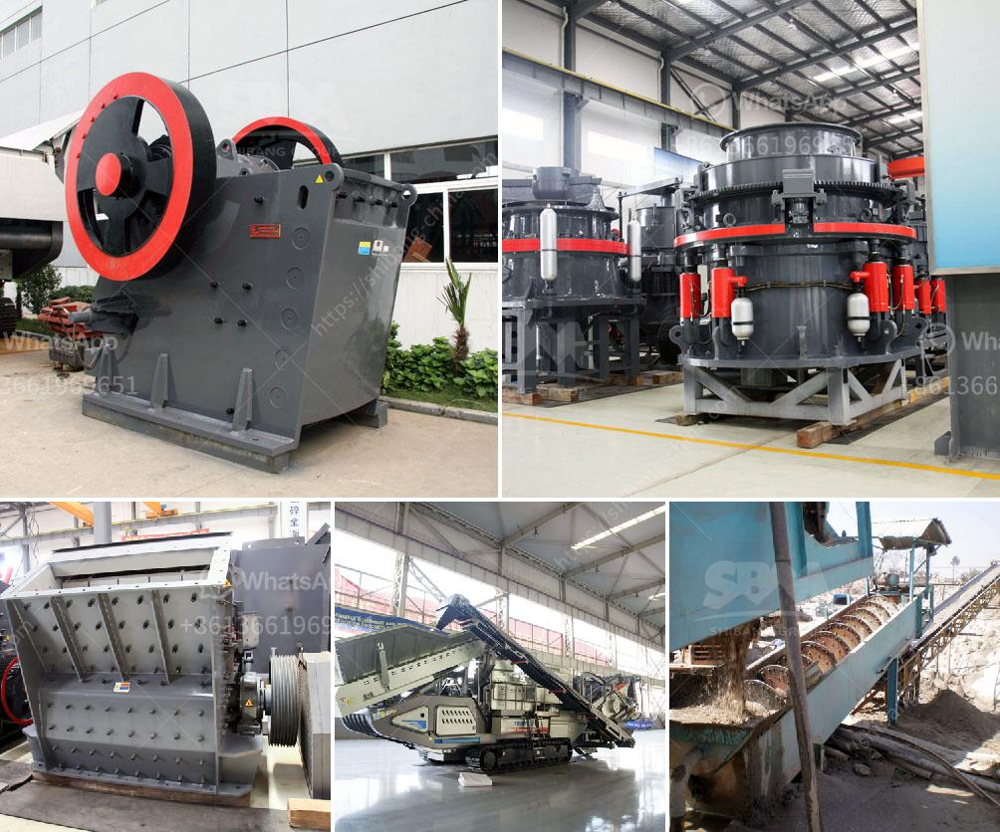

<h3>19mm crusher stone philippines quarry</h3>
The Philippines, a nation composed of more than 7,000 islands, is rich in natural resources, especially stone. The country’s extensive quarrying activities include the extraction of different types of stone for various construction purposes. One of the widely used stone products is the 19mm crusher stone, which comes from the Philippines quarry.

The 19mm crusher stone is commonly used for construction purposes, such as road and highway base materials, concrete aggregate, and cement production. It is a combination of small stones that are crushed into different sizes, ranging from 19mm to fine dust. This specific size is known for its versatility and compatibility with various construction projects.

Quarries in the Philippines play a crucial role in supplying the nation with enough building materials to support its booming construction industry. They provide a sustainable source of stone that is used for infrastructure development, housing projects, and other construction-related activities. The 19mm crusher stone is just one example of the many stone products that are produced and supplied by these quarries.

Quarrying operations in the Philippines involve extracting stone from the earth's surface or underground, depending on the location and type of stone being extracted. Once the stone is extracted, it undergoes a crushing process to achieve the desired size and texture. The 19mm crusher stone is then sorted and stored in stockpiles, ready for distribution and delivery to construction sites.

The 19mm crusher stone from Philippines quarries is highly sought after due to its quality and affordability. It is widely used as a base material for roads and highways, providing stability and strength to the infrastructure. Additionally, it is used in concrete production, providing the necessary aggregate to ensure the durability and strength of the construction material.

The versatility of the 19mm crusher stone makes it suitable for various construction projects, whether big or small. Its compact size allows for easier handling and transportation, reducing logistical challenges for contractors. Furthermore, its durability ensures that the construction materials built using this stone can withstand the test of time, providing a lasting solution that benefits both builders and end-users.

However, it is important to note that quarrying activities, including the extraction of the 19mm crusher stone, should be conducted in a sustainable and responsible manner. Quarry operators must adhere to strict regulations and practices to minimize any negative environmental impact. This includes proper waste management, reclamation efforts, and the implementation of necessary safety measures to protect workers in the quarry.

In conclusion, the 19mm crusher stone from the Philippines quarry plays a vital role in the nation's construction industry. It is a versatile and durable material that is widely used for various construction purposes. With proper quarrying practices, the industry can continue to supply a sustainable source of stone to support infrastructure development and other construction projects throughout the country.
<h3>Contact us</h3><ul><li><strong>Whatsapp:&nbsp;<a href="https://wa.me/8613661969651">+8613661969651</a></strong></li><li><a href="https://swt.shibang-china.com/?git&amp;zhl&amp;19mm crusher stone philippines quarry"><strong>Online Service(chat now)</strong></a></li></ul><h3>Related</h3><ul><li><a href='jaw crusher in nigeria.md'>jaw crusher in nigeria</a></li><li><a href='saudi arabia used conveyor belts price.md'>saudi arabia used conveyor belts price</a></li><li><a href='crusher plant equipment.md'>crusher plant equipment</a></li><li><a href='price of conveyor belts.md'>price of conveyor belts</a></li><li><a href='famous crusher and grinder manufacturer france.md'>famous crusher and grinder manufacturer france</a></li></ul>