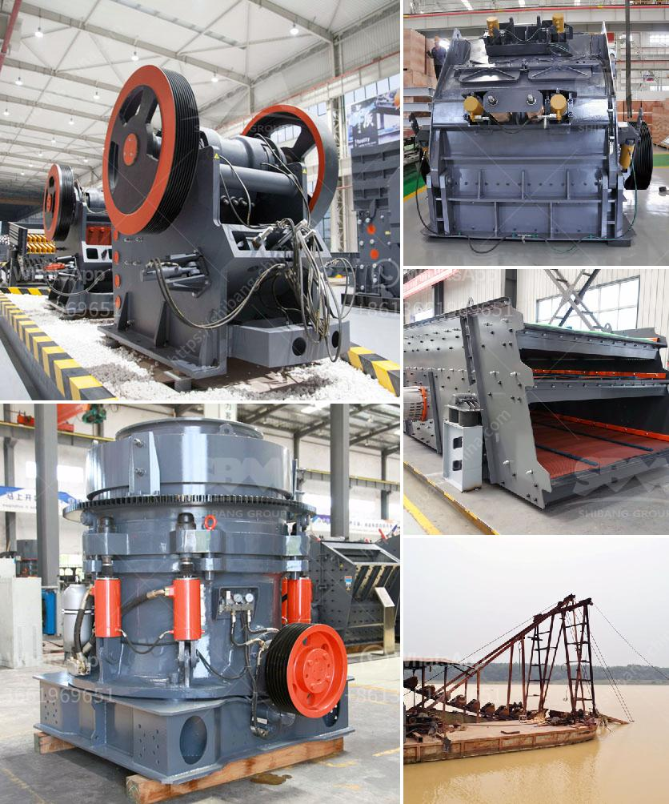

<h3>200tpd gold processing plant</h3>
A 200tpd gold processing plant is a common choice for small and medium-sized mines with a daily gold production capacity of 200 tons. The plant is designed to accommodate ore types with a high-grade gold content and is equipped with a gravity and flotation processing circuit, allowing the gold to be extracted from the ore and processed into a marketable gold concentrate.

The plant consists of several key components that work together to extract and process the gold. The ore is first crushed in a primary crusher, and then ground in a ball mill to a fine powder. The ground ore is then passed through a gravity concentrator, which uses gravity to separate the gold from the waste material.

The gravity concentrate is further processed using a flotation circuit. In this circuit, the gold is separated from the other minerals by adding reagents that cause the gold to float to the surface of the flotation cells. The gold concentrate is then collected and sent to a smelter, where it is further processed into gold bullion or other gold products.

The 200tpd gold processing plant is designed to be efficient, cost-effective, and environmentally friendly. It uses various techniques to maximize gold recovery and minimize the use of chemicals and energy.

Overall, a 200tpd gold processing plant is a viable option for small and medium-sized mines looking to process their gold ore efficiently and profitably. It combines gravity and flotation processing techniques to maximize gold recovery and minimize environmental impact. With the right design and equipment, this type of plant can be a valuable asset for any mining operation.
<h3>Contact us</h3><ul><li><strong>Whatsapp:&nbsp;<a href="https://wa.me/8613661969651">+8613661969651</a></strong></li><li><a href="https://swt.shibang-china.com/?git&amp;zhl&amp;200tpd gold processing plant"><strong>Online Service(chat now)</strong></a></li></ul><h3>Related</h3><ul><li><a href='mobile crusher ghana.md'>mobile crusher ghana</a></li><li><a href='ball mill procedure in practical.md'>ball mill procedure in practical</a></li><li><a href='prices for granite crushers.md'>prices for granite crushers</a></li><li><a href='cone crushing plant elevation.md'>cone crushing plant elevation</a></li><li><a href='sand and gravel crusher.md'>sand and gravel crusher</a></li></ul>