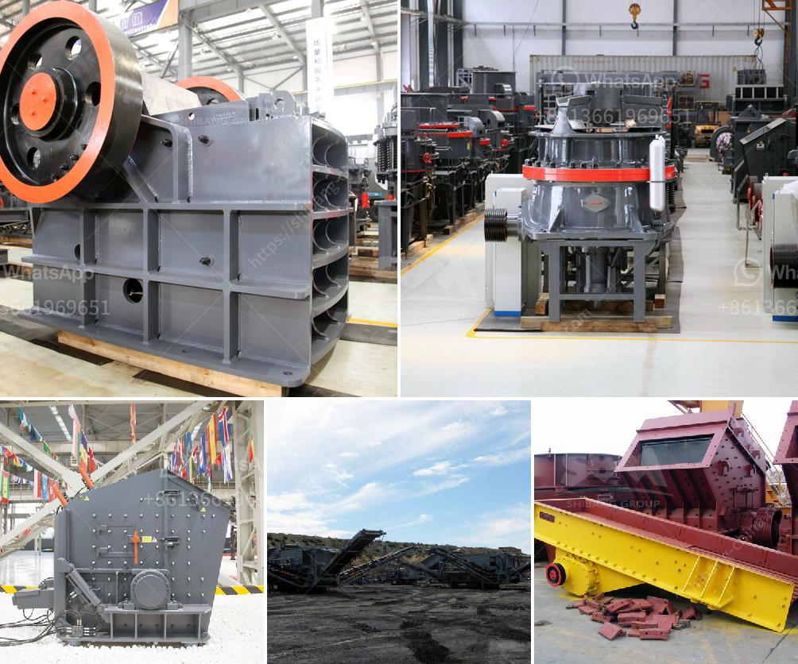

<h3>200tph gold ore processing plant</h3>
Title: The Efficiency of a 200TPH Gold Ore Processing Plant: Unleashing the Potential of Gold Extraction

Gold, a symbol of wealth and prosperity, has been highly coveted since ancient times. As one of the most valuable and sought-after precious metals, its extraction and processing require specialized equipment and techniques. In recent years, the popularity of gold ore processing plants has soared due to their efficiency in extracting gold from various ore sources. This article explores the significance and efficiency of a 200TPH gold ore processing plant.

A gold ore processing plant with a capacity of 200TPH efficiently processes gold ore material via the crushing, grinding, and gravity separation process. This plant is extensively used in the extraction of gold ore from various types of mine deposits.

The first step in processing gold ore is the size reduction of the ore fragments. Through the use of jaw crushers, the 200TPH gold ore processing plant ensures that the ore fragments are reduced to a size suitable for further processing. This size reduction process ensures that the gold particles are liberated from the surrounding rock, allowing for enhanced gold extraction efficiency.

After crushing, the gold ore is further refined through the grinding process. In the 200TPH gold ore processing plant, semi-autogenous grinding (SAG) mills are used along with water and steel balls. The grinding process breaks down the ore into a fine powder, enhancing the release of gold particles.

In the 200TPH gold ore processing plant, gravity separation is employed to separate gold particles from other non-valuable minerals. This process utilizes the differences in specific gravity between the gold particles and the surrounding gangue material. Specialized equipment such as centrifugal concentrators and shaking tables are used in gravity separation, enabling efficient collection of gold concentrate.

Thickening is an integral part of the gold ore processing plant, where the slurry or pulp is concentrated to increase the concentration of gold particles. This thickened pulp is then subjected to the leaching process, where gold is chemically extracted from the pulp using cyanide solution. The resulting gold-bearing solution is further processed and refined to produce gold bullion.

The efficiency of a 200TPH gold ore processing plant lies in its ability to extract gold from various types of ore deposits. By crushing, grinding, and utilizing gravity separation, the plant ensures that valuable gold particles are liberated and collected. Additionally, the thickening and leaching process enable efficient chemical extraction of gold from the ore pulp. It is evident that a 200TPH gold ore processing plant is a crucial asset in maximizing gold extraction efficiency.

With the continuous advancements in extraction technology and equipment, gold ore processing plants have become increasingly vital in unlocking the hidden potential of rich gold deposits worldwide. As the demand for gold continues to rise, these processing plants play a vital role in ensuring a steady supply of this precious metal, contributing to economic growth and prosperity in the global gold industry.
<h3>Contact us</h3><ul><li><strong>Whatsapp:&nbsp;<a href="https://wa.me/8613661969651">+8613661969651</a></strong></li><li><a href="https://swt.shibang-china.com/?git&amp;zhl&amp;200tph gold ore processing plant"><strong>Online Service(chat now)</strong></a></li></ul><h3>Related</h3><ul><li><a href='sand crusher machine.md'>sand crusher machine</a></li><li><a href='small concrete crusher used.md'>small concrete crusher used</a></li><li><a href='iron crushing plant in mexico.md'>iron crushing plant in mexico</a></li><li><a href='equipment for quarry.md'>equipment for quarry</a></li><li><a href='magnetic separator equipment for sale.md'>magnetic separator equipment for sale</a></li></ul>