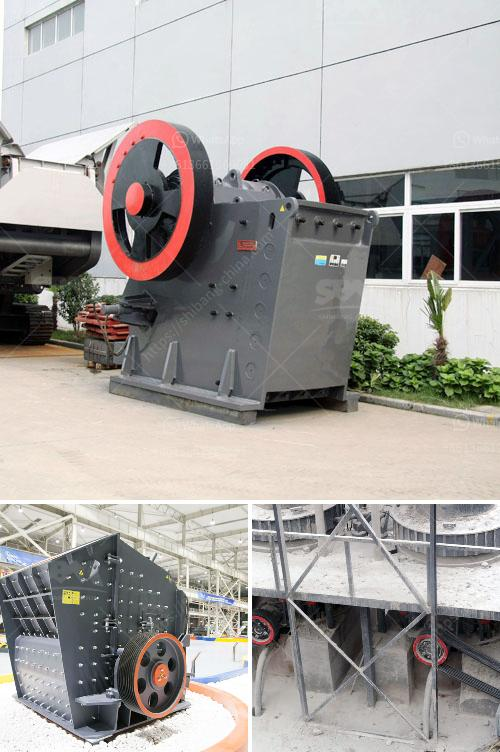

<h3>200tph stationary crushing plant</h3>
Working with a stationary crushing plant offers numerous benefits for quarries, mining and construction projects. Zenith Machinery has been providing reliable equipment for these types of projects for many years. With its high-quality crushing solutions, it has established itself as a leading crushing and screening operator in the industry.

When it comes to crushing hard rocks, stationary plants are the best options. These plants are built to handle the toughest materials, from granite to basalt. With a capacity of 200tph, they can efficiently process large amounts of material and ensure a consistent end product.

One of the primary advantages of a stationary plant is its reliability. Unlike mobile plants, which require frequent moving from one site to another, stationary plants remain in place for the entirety of the project. This reduces downtime and increases overall productivity. It also allows for a more streamlined workflow, as operators can focus solely on crushing and screening activities.

Additionally, stationary plants offer better control over the production process. With on-site crushing, materials can be processed immediately after extraction, eliminating the need for transportation and reducing the risk of material contamination. This results in higher quality end products that meet the strictest specifications.

The 200tph stationary crushing plant offered by Zenith is equipped with advanced technology. It features a jaw crusher for coarse crushing, a cone crusher for secondary crushing, and a VSI crusher for tertiary crushing. The high-quality end product provides a strong competitive edge in terms of cost efficiency and profitability.

The plant’s intelligent process control system guarantees continuous monitoring and adjusting of all crushing and screening parameters. This ensures optimal performance and maximizes the plant’s productivity. The system also provides real-time data on production and energy consumption, enabling operators to make informed decisions and improve overall efficiency.

The stationary crushing plant is equipped with hoppers, holding bins, and conveyors to transport the stones to a crusher. It can process the hard rocks through the jaw crusher and cone crusher respectively. In general, the cone crusher mainly breaks some hard materials, such as granite, basalt, tuff, etc., while the jaw crusher is used to crush various materials with compression strength less than 320MPa.

With its robust construction, reliable operation, and efficient performance, the 200tph stationary crushing plant is a perfect solution for crushing hard rocks. It provides peace of mind for operators and ensures high-quality end products, leading to improved standalone profitability. 

In conclusion, the 200tph stationary crushing plant offers a reliable, efficient, and cost-effective solution for crushing hard rocks. Its intelligent process control system and high-quality end products make it a top choice for operators in quarries, mining, and construction projects. By investing in this advanced technology, companies can improve their productivity, reduce downtime, and achieve better profitability.
<h3>Contact us</h3><ul><li><strong>Whatsapp:&nbsp;<a href="https://wa.me/8613661969651">+8613661969651</a></strong></li><li><a href="https://swt.shibang-china.com/?git&amp;zhl&amp;200tph stationary crushing plant"><strong>Online Service(chat now)</strong></a></li></ul><h3>Related</h3><ul><li><a href='vertical roller mill in cement plant.md'>vertical roller mill in cement plant</a></li><li><a href='gypsum machine price.md'>gypsum machine price</a></li><li><a href='gypsum crusher manufacturing plant.md'>gypsum crusher manufacturing plant</a></li><li><a href='marble grinding machine bosch make.md'>marble grinding machine bosch make</a></li><li><a href='50 tph stone crusher plant price.md'>50 tph stone crusher plant price</a></li></ul>