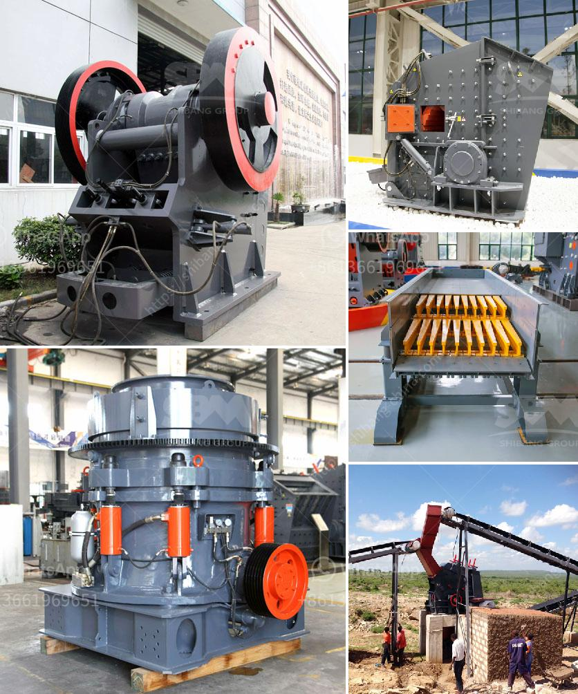

<h3>20mm feeding hydraulic cone crusher price</h3>
Cone crushers are widely used in mining, metallurgy, construction, road building, chemical and silicate industries. With the rapid development of infrastructure construction in various countries, the demand for cone crushers is growing, and the market for cone crushers is booming. One type of cone crusher that is commonly used in the market is the hydraulic cone crusher.

The hydraulic cone crusher is a cone crusher that is equipped with hydraulic adjustment device, which can quickly adjust the discharge port size and discharging granularity. When the material enters the crushing cavity of the hydraulic cone crusher, it is brought under the action of the hydraulic system, and the automatic control system can realize remote operation, which is convenient and efficient.

At present, the 20mm feeding hydraulic cone crusher is a hot-selling model in the market. Compared with traditional cone crushers, this type of cone crusher has several advantages. Firstly, the hydraulic system can effectively prevent the cone crusher from being damaged by iron and other materials that are too hard or unsuitable for crushing. Secondly, the hydraulic cone crusher can adjust the discharge port size and discharging granularity by simply operating the hydraulic device. Thirdly, the control system can realize the remote operation of the cone crusher, which is time-saving and labor-saving.

When it comes to the price of the 20mm feeding hydraulic cone crusher, there are various factors affecting it. The first factor is the brand. Different brands have different levels of production technology and product quality, so the prices of hydraulic cone crushers from different brands will vary. Generally speaking, well-known brands with good reputation in the market will have higher prices due to their superior quality and after-sales service.

The second factor is the model and specifications of the hydraulic cone crusher. Different models and specifications have different processing capacities, motor powers, and production efficiency. The higher the processing capacity and production efficiency, the higher the price of the hydraulic cone crusher.

The third factor is market demand. When the market demand for hydraulic cone crushers is high, the prices will also be relatively higher. Conversely, when the market demand is low, the prices will be relatively lower. Therefore, it is necessary to analyze the market demand and choose the right time to purchase the hydraulic cone crusher.

In conclusion, the 20mm feeding hydraulic cone crusher is a popular model in the cone crusher market. It has many advantages, such as the hydraulic adjustment device, automatic control system, and remote operation. The price of the hydraulic cone crusher is influenced by factors such as brand, model, specifications, and market demand. Therefore, it is important to consider these factors when purchasing a hydraulic cone crusher to ensure the best value for money.
<h3>Contact us</h3><ul><li><strong>Whatsapp:&nbsp;<a href="https://wa.me/8613661969651">+8613661969651</a></strong></li><li><a href="https://swt.shibang-china.com/?git&amp;zhl&amp;20mm feeding hydraulic cone crusher price"><strong>Online Service(chat now)</strong></a></li></ul><h3>Related</h3><ul><li><a href='mobile jaw crusher for sale india used price.md'>mobile jaw crusher for sale india used price</a></li><li><a href='rock crusher used in mining and quarry for sale.md'>rock crusher used in mining and quarry for sale</a></li><li><a href='china quarry crusher equipment.md'>china quarry crusher equipment</a></li><li><a href='crushing machine manufacturers china.md'>crushing machine manufacturers china</a></li><li><a href='raymond bowl coal mill drawings.md'>raymond bowl coal mill drawings</a></li></ul>