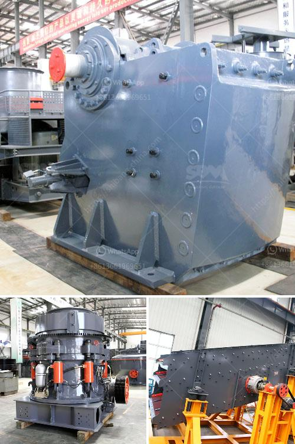

<h3>250 tph mobile stone crusher price in india</h3>
In recent years, India has surpassed China to become the world's fastest-growing major economy. Due to rapid urbanization and infrastructure development, the country is in high demand for construction aggregates and other raw materials for its projects. This has led to a surge in the demand for mobile stone crushers in the country.

A mobile stone crusher, commonly used for crushing big rocks into small-sized rocks, gravel or dust, is highly popular in the construction and mining industries. The user has the freedom to choose between a crawler or tyre mounted mobile crusher depending on the materials they need to crush and the conditions under which the crushing will be done.

One of the key factors that determine the overall performance of a mobile stone crusher is its capacity. Mobile stone crushers with a capacity of 250 tph and above are immensely popular in the Indian market due to their high production capability. This equipment not only offers a high crushing ratio but also allows quick and easy movement of the machine from one job site to another.

The price range of mobile crushers with a capacity of 250 tph is around INR 70,000,000 (USD 950,000) to INR 90,000,000 (USD 1,250,000). Needless to say, this wide range of price points allows Indian buyers to choose the crusher that best suits their budget.

Mobile stone crushers of 250 tph and above are also available in various capacity options ranging from 250 tph to 500 tph. Users can choose the best suited model according to their material and production requirements. Some of the popular models with capacities ranging from 250 tph to 500 tph are Metso LT120, Sandvik QJ341, Sandvik QJ241, Terex Finlay J1175, Powerscreen Premiertrak 400X, and many more.

Apart from the capacity, the price of a mobile stone crusher also varies depending on the types of features it offers. A mobile stone crusher with high-quality features such as the automated level control, automatic tramp iron release, and hydraulic CSS adjustment can significantly improve the efficiency and productivity of the crushing process. However, such advanced features may come with a higher price tag.

In conclusion, the demand for mobile stone crushers in India is steadily increasing due to rapid urbanization and infrastructure development projects. A mobile stone crusher with a capacity of 250 tph and above can be easily taken anywhere without hassle. With its strong adaptability and flexible configuration, the equipment proves to be a smart and sustainable choice for construction and mining companies alike. Considering the wide range of models and prices available in the Indian market, buyers can select the best-suited mobile stone crusher that fits their budget and meets their crushing requirements.
<h3>Contact us</h3><ul><li><strong>Whatsapp:&nbsp;<a href="https://wa.me/8613661969651">+8613661969651</a></strong></li><li><a href="https://swt.shibang-china.com/?git&amp;zhl&amp;250 tph mobile stone crusher price in india"><strong>Online Service(chat now)</strong></a></li></ul><h3>Related</h3><ul><li><a href='quarry crusher manufacturer.md'>quarry crusher manufacturer</a></li><li><a href='dolomite beater mill crusher.md'>dolomite beater mill crusher</a></li><li><a href='sand and gravel crusher.md'>sand and gravel crusher</a></li><li><a href='crusher machine suppliers.md'>crusher machine suppliers</a></li><li><a href='desain gambar vibrating screen 100ton jam.md'>desain gambar vibrating screen 100ton jam</a></li></ul>