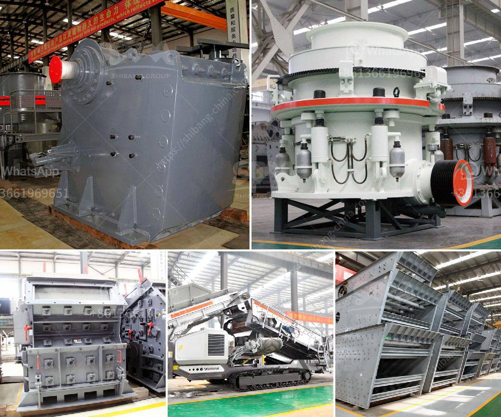

<h3>2nd hand crushers thailand</h3>
Thailand, with its booming construction industry, has been a major player in the global economy. This rapid development has led to an increased demand for new buildings, roads, and other infrastructures. However, with the rising concerns about the environment and sustainability, it is imperative to find alternative solutions that can reduce the strain on resources and promote a circular economy. This is where the concept of second-hand crushers comes into play.

Second-hand crushers, as the name suggests, are crushers that have already been used by another party. These crushers are typically sold after completing their initial purpose or when they are no longer needed. In an industry like construction, where heavy machinery is an integral part of the operations, second-hand crushers provide a sustainable solution to meet the growing demands.

One of the primary benefits of purchasing second-hand crushers is the cost savings. New crushers can be quite expensive, making it challenging for smaller construction companies or contractors with limited budgets to invest in such equipment. By opting for second-hand crushers, these businesses can get the required machinery at a significantly lower price, without compromising on quality or performance.

Moreover, buying second-hand crushers contributes to reducing waste and promoting a circular economy. In the construction industry, there is a significant amount of waste generated from demolition sites, which includes concrete, bricks, and other materials. Second-hand crushers help in recycling these materials by processing them into smaller sizes, which can be used as aggregates in new construction projects. This process not only minimizes waste but also reduces the need for extracting new raw materials, thus conserving natural resources.

Furthermore, second-hand crushers provide an opportunity for businesses to upgrade their machinery without burdening the environment. Upgrading equipment is a common practice in the construction industry, as newer models offer enhanced efficiency and productivity. However, disposing of the old machinery can be problematic and can have a significant environmental impact. By selling their used crushers, businesses can ensure that these machines are put to good use by other companies, reducing the need for new manufacturing and promoting sustainable practices.

In Thailand specifically, second-hand crushers have gained popularity in recent years. The increasingly stringent regulations on emissions and environmental impact have prompted businesses to explore sustainable alternatives. The accessibility and availability of second-hand crushers in the country have made this solution an attractive choice for construction companies looking to improve their environmental footprint.

In conclusion, second-hand crushers offer a sustainable solution for the construction industry in Thailand and worldwide. With their cost-effectiveness, waste reduction, and opportunities for upgrading machinery, these crushers contribute to a circular economy and help protect the environment. As the demand for new buildings and infrastructure continues to rise, it is crucial to promote such sustainable practices to ensure a greener and more sustainable future.
<h3>Contact us</h3><ul><li><strong>Whatsapp:&nbsp;<a href="https://wa.me/8613661969651">+8613661969651</a></strong></li><li><a href="https://swt.shibang-china.com/?git&amp;zhl&amp;2nd hand crushers thailand"><strong>Online Service(chat now)</strong></a></li></ul><h3>Related</h3><ul><li><a href='stone crushers hydraulic.md'>stone crushers hydraulic</a></li><li><a href='cone crusher second hand for sale in south africa.md'>cone crusher second hand for sale in south africa</a></li><li><a href='equipment for ferro manganese plant.md'>equipment for ferro manganese plant</a></li><li><a href='start up granite quarry business.md'>start up granite quarry business</a></li><li><a href='vibrating screen size decision.md'>vibrating screen size decision</a></li></ul>