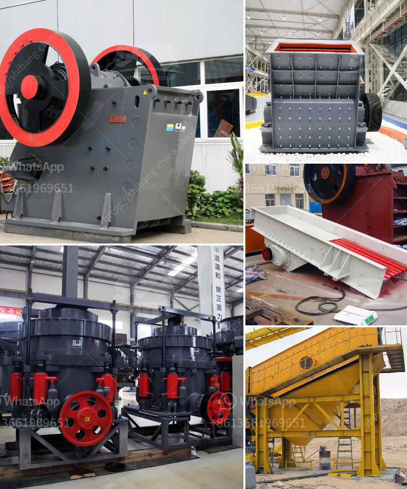

<h3>30 tons per hour washing plant gold</h3>
Gold is a precious metal that has been sought after for centuries for its beauty and value. It is used in various industries and jewelry making, making it an essential commodity. In order to extract gold from the ground, mining companies must employ various methods, one of which includes the use of washing plants.

A washing plant is a facility that uses water to wash and separate gold from other minerals. These plants are designed to extract gold from alluvial deposits, where gold particles are found in loose sediment, such as sand, gravel, or clay. The process involves feeding the material into a hopper, where it is then transported to a trommel screen.

A trommel screen is a rotating cylindrical sieve that is used to separate materials based on their size. The gold-bearing material is dumped into the trommel, where it is agitated and washed. As it rotates, the smaller particles pass through the small holes in the screen, while larger rocks and debris are carried out the end of the trommel.

Once the material has been screened and sorted, it is then directed to a series of sluices. A sluice is a long, narrow trough that is lined with riffles, or grooves, which create an artificial current. As the gold-bearing material flows through the sluice, the heavier gold particles get trapped in the riffles, while the lighter materials are carried away.

The process of washing gold in a plant can be quite complex, requiring specialized equipment and skilled operators. However, advancements in technology have made it possible to process larger quantities of material in a shorter amount of time. For instance, a modern washing plant can process up to 30 tons of material per hour.

These high-capacity washing plants are equipped with powerful pumps and motors that allow for efficient material handling. They are also equipped with multiple sluices and trommels to maximize the gold recovery rate. Additionally, these plants often have automated controls and monitoring systems to ensure optimal performance and safety.

The 30 tons per hour washing plant gold is an example of an efficient and productive plant that can process a large amount of material in a short period of time. This type of plant is ideal for mining operations that have a consistent flow of material, as it can significantly increase the overall gold production.

In conclusion, the use of a washing plant to extract gold is a common and effective method used by mining companies. These plants have the capacity to process large quantities of material, making them highly efficient and productive. The 30 tons per hour washing plant gold is a testament to the advancements in technology, allowing for faster and more efficient gold extraction. With the continued development of mining technology, we can expect even higher-capacity washing plants in the future, further increasing gold production.
<h3>Contact us</h3><ul><li><strong>Whatsapp:&nbsp;<a href="https://wa.me/8613661969651">+8613661969651</a></strong></li><li><a href="https://swt.shibang-china.com/?git&amp;zhl&amp;30 tons per hour washing plant gold"><strong>Online Service(chat now)</strong></a></li></ul><h3>Related</h3><ul><li><a href='south africa mining law on crusher.md'>south africa mining law on crusher</a></li><li><a href='rock crushing plants in tanzania.md'>rock crushing plants in tanzania</a></li><li><a href='smallest cement plant.md'>smallest cement plant</a></li><li><a href='manufacturing process of bentonite powder.md'>manufacturing process of bentonite powder</a></li><li><a href='top german mining equipment manufacturers.md'>top german mining equipment manufacturers</a></li></ul>