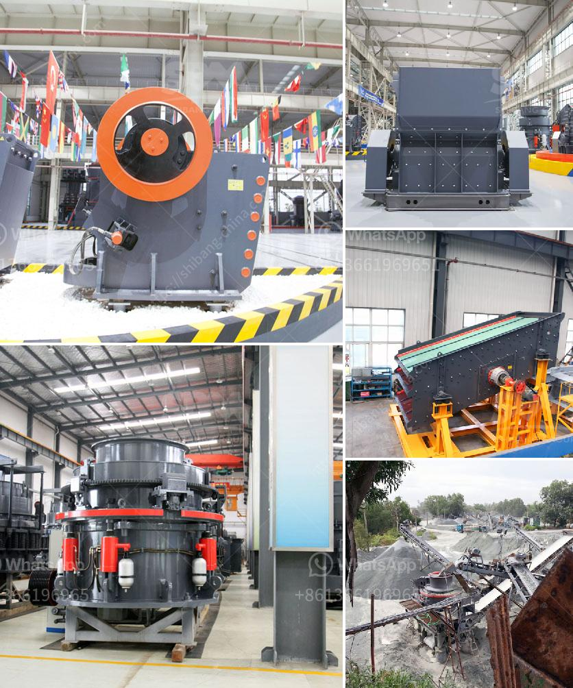

<h3>4 roller mill for stone</h3>
The 4 roller mill for stone is an important machine in the milling process. It is mainly used to grind various materials into powder for use in various industries such as construction, chemical, metallurgy, mining, and agriculture. This machine has the advantages of high efficiency, low energy consumption, and durability, making it a popular choice among users.

One of the key features of the 4 roller mill is its unique design. This machine consists of four grinding rollers placed in a specific pattern. The rollers apply pressure to the material being milled, crushing and grinding it into fine particles. The design ensures that all four rollers work in tandem, resulting in uniform and efficient grinding.

The 4 roller mill is suitable for processing a wide range of materials. It can handle both soft and hard materials, including limestone, gypsum, coal, carbon black, and various ores. The machine's versatility makes it a valuable asset in many industries.

One of the main advantages of the 4 roller mill is its high grinding efficiency. The four rollers rotate at different speeds, ensuring that the material is thoroughly ground and the particles are evenly distributed. This results in a higher production rate and better quality of the final product.

Additionally, the 4 roller mill is energy-efficient. The unique design of the machine reduces energy consumption compared to traditional milling machines. This not only helps to reduce operating costs but also makes it an environmentally friendly option.

The durability of the 4 roller mill is another key benefit. The machine is built to withstand heavy use and harsh conditions. The high-quality materials used in its construction ensure its longevity and reliability. With proper maintenance and care, the 4 roller mill can provide years of trouble-free operation.

In conclusion, the 4 roller mill for stone is a versatile and efficient machine for grinding various materials into powder. Its unique design, high grinding efficiency, low energy consumption, and durability make it a valuable asset in many industries. Whether used in construction, chemical, metallurgy, mining, or agriculture, this machine delivers excellent results. Consider investing in a 4 roller mill for stone to improve your milling process and enhance your production capabilities.
<h3>Contact us</h3><ul><li><strong>Whatsapp:&nbsp;<a href="https://wa.me/8613661969651">+8613661969651</a></strong></li><li><a href="https://swt.shibang-china.com/?git&amp;zhl&amp;4 roller mill for stone"><strong>Online Service(chat now)</strong></a></li></ul><h3>Related</h3><ul><li><a href='crusher plant price pakistan.md'>crusher plant price pakistan</a></li><li><a href='contribution of quarrying in nigeria economy.md'>contribution of quarrying in nigeria economy</a></li><li><a href='dolomite beater mill crusher.md'>dolomite beater mill crusher</a></li><li><a href='cost o gypsum processing machines.md'>cost o gypsum processing machines</a></li><li><a href='dolomite crusher machine plant.md'>dolomite crusher machine plant</a></li></ul>