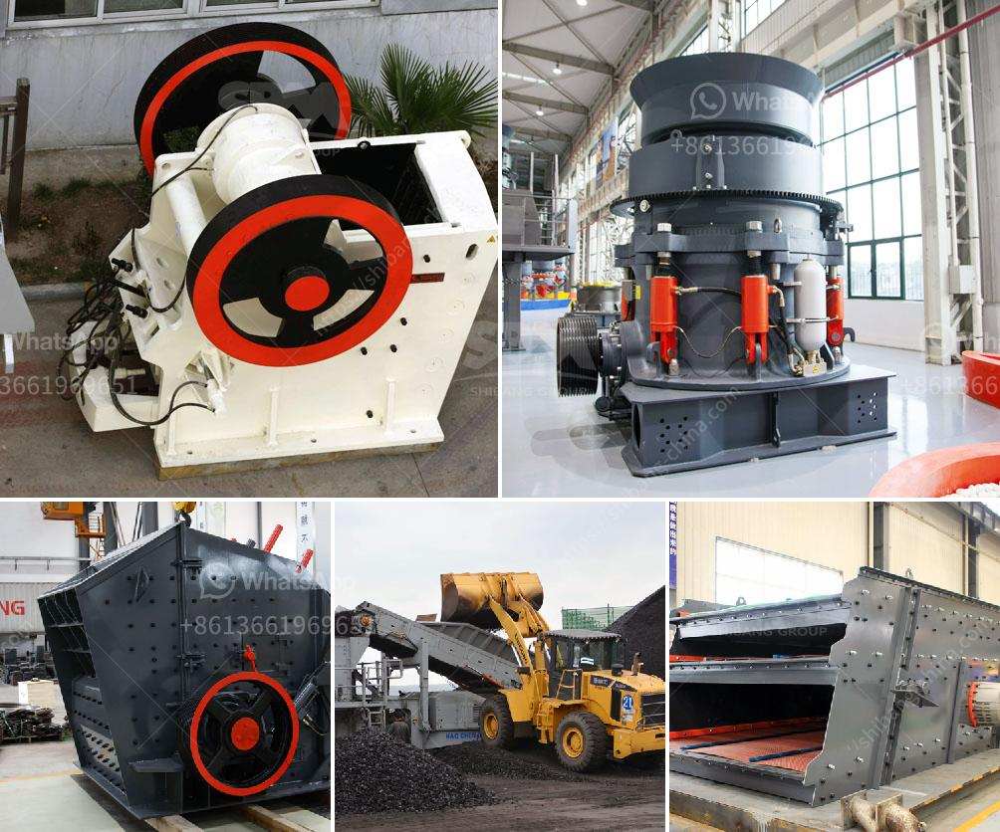

<h3>50 tph stone crusher plant price</h3>
The 50 tph stone crusher plant price is widely used in the industry of mining, building materials, chemical industry, metallurgy and fodder. It can crush materials with middle or less than middle hardness into secondary or fine granularity, such as, barite, limestone, terrazzo, silica sandstone, coal, coke, gypsum, aluminum sulfate, slag, etc.

Stone crushing plant includes vibrating feeder, jaw crusher, impact crusher, vibrating screen, belt conveyor and centrally electric controlling system, etc. The designed capacity is from 50 tph to 800 tph. To meet customers' specific requirement, we can also add other equipment such as cone crusher, dust catcher on the production line.

Stone crusher plant price in India is the world's leading rock and mineral processing equipment manufacturing enterprises, the construction of our company's portable stone crusher, feeder, screen, belt conveyors and other equipment have been widely used in India.

Mobile stone crusher plant price for sale in India, cost of Small Mobile Stone Crusher in India. Portable Crushing Plant,Stone Crusher Machine Price In India. More. Stone Crusher Machine Price In India, Stone.

A wide variety of stone crusher plant prices options are available to you, such as jaw crusher, impact crusher, and cone crusher. You can also choose from free samples. There are 11,124 stone crusher plant prices suppliers, mainly located in Asia.

The top supplying countries are China (Mainland), Turkey, and Iran (Islamic Republic of), which supply 99%, 1%, and 1% of stone crusher plant prices respectively. Stone crusher plant prices products are most popular in Africa, Domestic Market, and Southeast Asia. You can ensure product safety by selecting from certified suppliers, including 5,486 with ISO9001, 2,951 with Other, and 190 with ISO14001 certification.

In addition, according to customers' demand to material specification and stones purpose, we can combine different models together to meet various needs. Stone crushing plant have been the most popular equipment in India.

Stone crushing plant used in different purposes can be divided into several types. First, the jaw crusher is used as the primary crushing machine. Then the cone crusher or impact crusher is used to crush the materials into smaller size. Various models with different specifications are available for different purposes. Second, vibrating screen is used to separate the crushed stones into different sizes.

The 50 tph stone crusher plant price is widely used in the mining industry and has been highly praised by customers. There are more than 10 types of models with different specifications to meet the needs of different customers. For more information about stone crusher plant prices, please contact us for free.
<h3>Contact us</h3><ul><li><strong>Whatsapp:&nbsp;<a href="https://wa.me/8613661969651">+8613661969651</a></strong></li><li><a href="https://swt.shibang-china.com/?git&amp;zhl&amp;50 tph stone crusher plant price"><strong>Online Service(chat now)</strong></a></li></ul><h3>Related</h3><ul><li><a href='i am looking for a stone crusher in malaysia.md'>i am looking for a stone crusher in malaysia</a></li><li><a href='list of machinery in gypsum crushing and limestone.md'>list of machinery in gypsum crushing and limestone</a></li><li><a href='used crushers sale usa.md'>used crushers sale usa</a></li><li><a href='stone crusher prices.md'>stone crusher prices</a></li><li><a href='hammer mill technical.md'>hammer mill technical</a></li></ul>