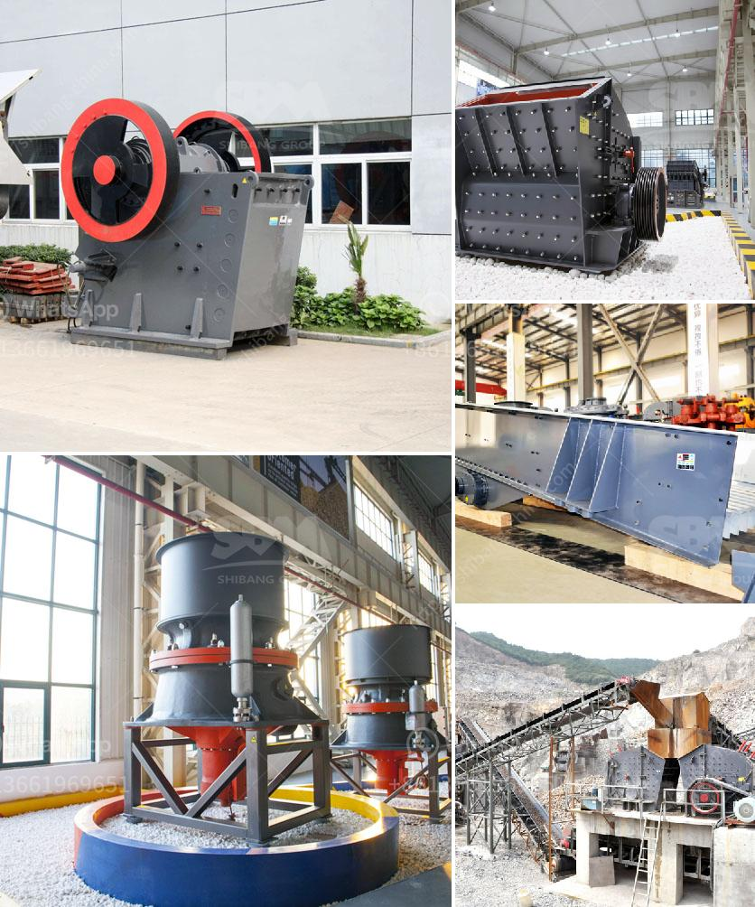

<h3>activated carbon plant for sale</h3>
Activated carbon is a highly versatile material used in a wide range of industries for numerous applications. It is a form of carbon that has been processed to have a large surface area capable of adsorbing impurities from liquids and gases. Due to its high adsorption capacity, activated carbon is an essential component in water treatment systems, air purification systems, and industrial processes. As the demand for activated carbon continues to grow, many businesses are considering investing in an activated carbon plant for sale.

Investing in an activated carbon plant can be a lucrative business opportunity. The plant would produce activated carbon from raw materials such as coal, wood, or coconut shells, through a process called activation. The raw materials are first carbonized to remove volatile compounds and then activated by exposing them to high temperatures and steam in a controlled environment. This process creates porous carbon particles with a large surface area, making them highly effective at adsorbing impurities.

There are several reasons why investing in an activated carbon plant can be a profitable venture. Firstly, there is a growing demand for activated carbon in various industries. In water treatment, activated carbon is used for the removal of organic contaminants, taste and odor compounds, and chlorine. It is also widely employed in air purification systems to remove volatile organic compounds (VOCs) and other pollutants. The pharmaceutical, food, and beverage industries also utilize activated carbon for purification purposes. This increasing demand ensures a steady market for activated carbon, making it a valuable product to produce and sell.

Secondly, the production of activated carbon can be a cost-effective business. The raw materials required for manufacturing activated carbon are relatively easy to source, especially if the plant is located in an area abundant in coal, wood or coconut shells. These raw materials are usually available at low cost, which contributes to the profitability of the business. Additionally, the manufacturing process of activated carbon is relatively straightforward, with advancements in technology making it more efficient and less labor-intensive.

Furthermore, an activated carbon plant can offer additional revenue streams. Apart from selling activated carbon, by-products such as biochar and wood vinegar can also be generated during the production process. Biochar has agricultural applications as a soil amendment for improved plant growth and carbon sequestration, while wood vinegar is used as an organic pesticide and plant growth promoter. These by-products can be sold to enhance the profitability of the plant.

Finally, an activated carbon plant can be environmentally beneficial. The production of activated carbon involves making use of waste materials such as coconut shells or wood residues, which reduces the environmental impact of these waste materials. Additionally, activated carbon plays a crucial role in pollution control by adsorbing harmful pollutants from air and water. By investing in an activated carbon plant, businesses can contribute to environmental sustainability while also generating profits.

In conclusion, the demand for activated carbon is surging, making investing in an activated carbon plant a promising business opportunity. The plant would produce a valuable product with various applications in water treatment, air purification, and industrial processes. The abundance of raw materials, the simplicity of the manufacturing process, and the potential for additional revenue streams make an activated carbon plant a cost-effective and profitable venture. Furthermore, the environmental benefits of producing activated carbon contribute to sustainability. Therefore, for entrepreneurs looking for a profitable and sustainable business, an activated carbon plant for sale is worth considering.
<h3>Contact us</h3><ul><li><strong>Whatsapp:&nbsp;<a href="https://wa.me/8613661969651">+8613661969651</a></strong></li><li><a href="https://swt.shibang-china.com/?git&amp;zhl&amp;activated carbon plant for sale"><strong>Online Service(chat now)</strong></a></li></ul><h3>Related</h3><ul><li><a href='concrete crusher for rent michigan.md'>concrete crusher for rent michigan</a></li><li><a href='used quarry equipment from usa.md'>used quarry equipment from usa</a></li><li><a href='vrm vertical roller mill.md'>vrm vertical roller mill</a></li><li><a href='crusher in coal mining.md'>crusher in coal mining</a></li><li><a href='200tph gold ore processing plant.md'>200tph gold ore processing plant</a></li></ul>