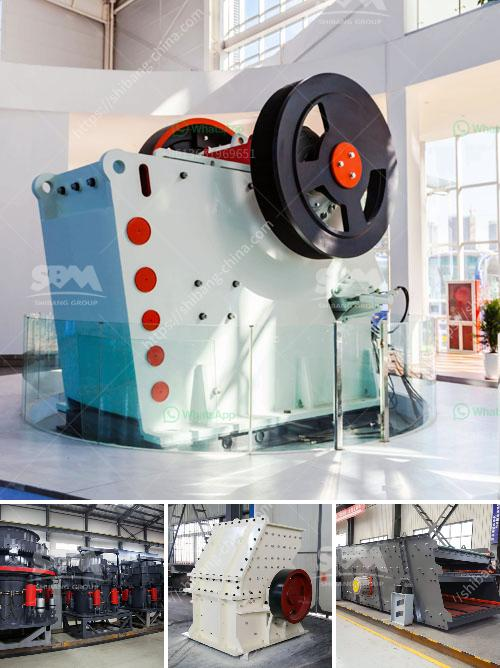

<h3>advantage of wet grinding in cement manufacturing</h3>
Cement production is a demanding process that requires a high level of efficiency to properly optimize production and minimize the cost per ton. Wet grinding of cement raw material is one of the techniques used to reduce energy consumption in cement manufacturing.

Wet grinding makes use of abundant moisture content present in the raw material, allowing a more efficient and economical process compared to dry grinding. Here are some key advantages of wet grinding in cement manufacturing:

1. Energy Efficiency: Wet grinding requires significantly less energy compared to dry grinding techniques. This is because wet grinding utilizes the inherent moisture in the raw materials, reducing the need for energy-intensive drying processes. The moisture content acts as a lubricant, reducing friction and heat generation during grinding, resulting in lower energy consumption.

2. Improved Particle Size Distribution: Wet grinding facilitates better control over the particle size distribution of the cement. Smaller particle sizes lead to improved cement properties, such as increased early strength and reduced setting time. The use of wet grinding ensures better dispersion of fine particles, leading to a more uniform and stable product.

3. Less Dust Generation: Wet grinding significantly reduces the generation of dust during the grinding process. Dust can be a considerable nuisance and health risk in a cement manufacturing plant. By keeping moisture levels high, wet grinding effectively minimizes dust emissions, creating a healthier and cleaner working environment.

4. Higher Production Efficiency: Wet grinding allows for a higher milling capacity and throughput compared to dry grinding methods. The reduced heat during the grinding process prevents the formation of clumps and agglomerations, enhancing the flowability and maintainability of cement production.

5. Environmental Benefits: By utilizing wet grinding, cement manufacturers can contribute to environmental sustainability. The reduction in energy consumption translates into a decreased carbon footprint, lowering greenhouse gas emissions. Additionally, the reduced dust generation improves air quality within and around the manufacturing plant.

In conclusion, wet grinding in cement manufacturing offers several significant advantages such as improved energy efficiency, better particle size distribution, reduced dust generation, higher production efficiency, and environmental benefits. By incorporating wet grinding techniques, cement manufacturers can achieve more efficient and sustainable production processes, ultimately leading to higher quality cement products.
<h3>Contact us</h3><ul><li><strong>Whatsapp:&nbsp;<a href="https://wa.me/8613661969651">+8613661969651</a></strong></li><li><a href="https://swt.shibang-china.com/?git&amp;zhl&amp;advantage of wet grinding in cement manufacturing"><strong>Online Service(chat now)</strong></a></li></ul><h3>Related</h3><ul><li><a href='small rock crusher machine for sale.md'>small rock crusher machine for sale</a></li><li><a href='lime stone crusher section in cement plant pdf.md'>lime stone crusher section in cement plant pdf</a></li><li><a href='jaw crusher grinding.md'>jaw crusher grinding</a></li><li><a href='coal conveyor supplier from india.md'>coal conveyor supplier from india</a></li><li><a href='sell european stone crusher.md'>sell european stone crusher</a></li></ul>