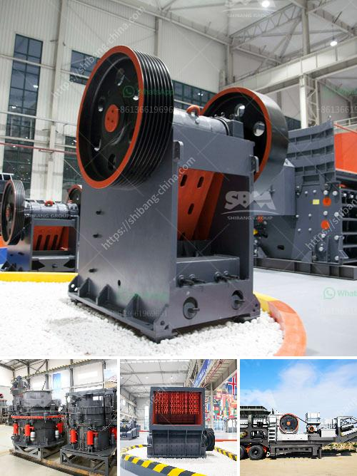

<h3>advantages and disadvantages of a roll crusher</h3>
A Roll Crusher is a piece of heavy-duty equipment used in mining and industrial processes. It features a pair of large wheels or cylinders mounted on horizontal axis. When rocks, ore, and other materials pass between the two cylinders, they are crushed or ground into smaller pieces. 

1. It has a simple structure and a compact design, making it lightweight and easy to operate. This reduces both maintenance and labour costs.

2. Roll crushers deliver very consistent sizes of crushed material. This ensures that the product is of uniform size and shape, and it eliminates the need for further screening.

3. Roll crushers are energy-efficient. They generate relatively little heat during operation, which reduces the risk of overheating and prolongs the lifespan of the machinery.

4. Roll crushers are cost-effective. They are relatively inexpensive to purchase and have low operational costs, making them affordable for small and medium-sized businesses.

5. Roll crushers are highly productive. They can process large quantities of materials in a single pass, which means increased production rates and faster processing times.

1. Roll crushers are not efficient in crushing hard rocks. They are designed to work with softer rocks such as limestone and coal. If used to crush hard rocks, their crushing efficiency is greatly reduced.

2. Roll crushers are not suitable for crushing materials with large amounts of moisture, as they tend to clog and jam.

3. Roll crushers are not recommended for use in crushing materials that are sticky or contain high clay content. This is because they tend to become jammed and are difficult to clean.

4. Roll crushers produce excessive amounts of dust and fines during operation. This can lead to environmental issues and health hazards for workers, as the particles can be inhaled or contaminate nearby water sources.

5. Roll crushers have a limited control over particle size distribution and can only produce a narrow range of size fractions. This makes them unsuitable for applications where a wide range of sizes is required.

In conclusion, a roll crusher is a piece of heavy-duty equipment used in mining and industrial processes. It offers several advantages, including its compact design, energy efficiency, and cost-effectiveness. However, roll crushers also have limitations, such as being less efficient in crushing hard rocks and not suitable for materials with high moisture or clay content. Ultimately, the suitability of a roll crusher depends on the specific needs and requirements of the application.
<h3>Contact us</h3><ul><li><strong>Whatsapp:&nbsp;<a href="https://wa.me/8613661969651">+8613661969651</a></strong></li><li><a href="https://swt.shibang-china.com/?git&amp;zhl&amp;advantages and disadvantages of a roll crusher"><strong>Online Service(chat now)</strong></a></li></ul><h3>Related</h3><ul><li><a href='sell stone crusher in philippines.md'>sell stone crusher in philippines</a></li><li><a href='stone crushing machine in kenya.md'>stone crushing machine in kenya</a></li><li><a href='used raymond mills barite raymond mill.md'>used raymond mills barite raymond mill</a></li><li><a href='type of quarry crusher equipment.md'>type of quarry crusher equipment</a></li><li><a href='agen jaw crusher kenya.md'>agen jaw crusher kenya</a></li></ul>