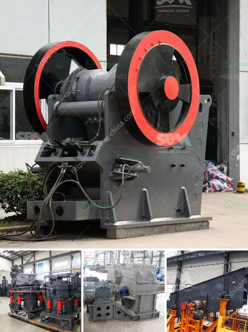

<h3>agen jaw crusher kenya</h3>
Crusher equipment is one of the indispensable machines in the mining industry. It plays a crucial role in breaking down large rocks into smaller pieces. For this reason, it has been developed to be more efficient and reliable. One such equipment is the jaw crusher, which is known for its ability to crush materials of various hardness levels. In Kenya, there is a wide range of jaw crushers available for your selection.

Agen jaw crusher Kenya has a long history in the mining industry. It has been developed from the original version to the latest advanced version. Shanghai SBM is a professional mining machine manufacturer and supplier in the world. It has the advanced technology of making crusher machine. Stone crusher machines in Kenya are extensively used in the mining industry for the preliminary crushing of rocks. The key features of these stone crusher machines in Kenya are the ability to crush relatively larger rocks with finer reduction ratios, thereby saving on overall costs.

To achieve the desired particle size distribution of crushed rocks, it is necessary to grade the crushed stones in a process called screening. Screening involves separating the different sizes of crushed materials using a vibrating screen. This process ensures that the final product is uniform and free from impurities. Agen jaw crusher Kenya integrates screening and crushing into a single machine, which saves time and labor.

However, the efficiency of jaw crushers can be greatly affected by factors such as feed size, production levels, and even climatic conditions. It is for this reason that agen jaw crusher Kenya offers a wide range of jaw crushers to choose from. These crushers are designed to withstand various operating conditions, ensuring maximum productivity even under challenging circumstances.

Agen jaw crusher Kenya offers different types of crushers with various specifications. Each machine is designed with a particular purpose and specific features. Whether you need a primary crusher for large pieces of rock or a secondary crusher for smaller rocks, agen jaw crusher Kenya has a variety of options to suit your needs.

In addition to their performance and durability, agen jaw crusher Kenya also focuses on environmental sustainability. These crushers are designed with advanced technologies that reduce noise and dust emissions. This ensures a healthier working environment for the operators and nearby communities. Furthermore, they have implemented energy-saving features, resulting in lower carbon emissions and reduced energy consumption.

When it comes to after-sale service, agen jaw crusher Kenya has a team of experienced technicians to provide installation, training, and maintenance support. They understand that downtime is costly for their clients, so they are committed to providing timely technical assistance to help resolve any issues that may arise.

In conclusion, agen jaw crusher Kenya is a reliable equipment for crushing hard rocks efficiently. It has been developed to be more environmentally friendly without compromising on performance. With a wide range of crushers to choose from, agen jaw crusher Kenya offers the perfect solution for your crushing needs.
<h3>Contact us</h3><ul><li><strong>Whatsapp:&nbsp;<a href="https://wa.me/8613661969651">+8613661969651</a></strong></li><li><a href="https://swt.shibang-china.com/?git&amp;zhl&amp;agen jaw crusher kenya"><strong>Online Service(chat now)</strong></a></li></ul><h3>Related</h3><ul><li><a href='ball milling machines suppliers in egypt.md'>ball milling machines suppliers in egypt</a></li><li><a href='south africa mining law on crusher.md'>south africa mining law on crusher</a></li><li><a href='chrome crusher machine price list.md'>chrome crusher machine price list</a></li><li><a href='concrete crusher price philippines.md'>concrete crusher price philippines</a></li><li><a href='impact coal crusher.md'>impact coal crusher</a></li></ul>