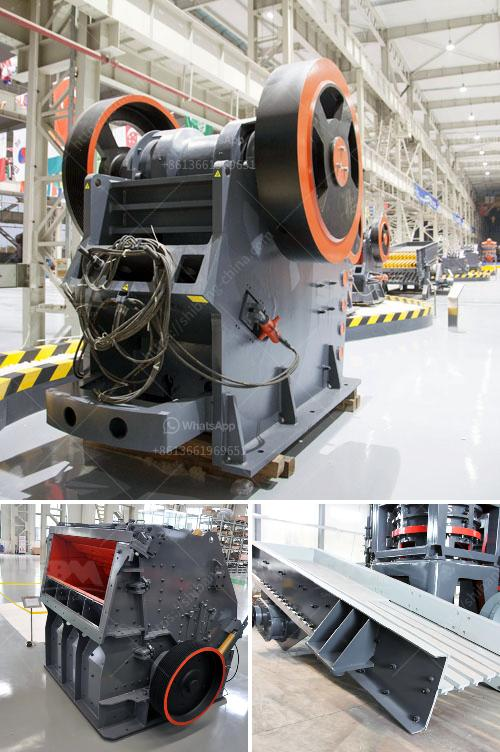

<h3>aggregate crusher plant price</h3>
When it comes to investing in a new crushing plant, price plays a crucial role in its success. You need to be sure that the equipment you choose is reliable and can withstand the tough conditions that exist in the mining and quarrying industry. With so many options available, finding the right crusher plant at the right price can be challenging.

The price of an aggregate crusher plant varies depending on several factors. The primary factor is the material you will be producing. This will determine the type of crusher you need to purchase. If you are producing sand or aggregate material for road construction, for example, you will need a different type of crusher compared to if you are producing concrete aggregate.

Another factor affecting the price is the capacity of the crusher. Higher capacity crushers are generally more expensive than lower capacity ones. However, if you have a high production demand, it is worth investing in a larger capacity crusher to maximize your output and minimize downtime.

The specific configuration of the crushing plant can also impact the price. Some crushers come with additional features, such as a vibrating feeder or a screen. These features can enhance the efficiency of the crushing process but also increase the cost. It's essential to carefully consider which features are necessary for your operation to balance functionality and price.

Additionally, the brand and quality of the equipment can influence its price. Well-known brands with a reputation for producing high-quality machinery typically charge higher prices. While it may be tempting to opt for a cheaper option, it is crucial to ensure that the equipment you purchase is durable and reliable. Investing in a reputable brand can provide you with peace of mind and minimize the risk of breakdowns or malfunctions.

Considering the long-term costs of owning and operating the equipment is also vital. Look beyond the initial price and evaluate the maintenance and operating costs associated with the crusher plant. Higher quality equipment may require less frequent maintenance and have lower energy consumption, saving you money in the long run.

To get an accurate price for an aggregate crusher plant, it's advisable to contact suppliers and request quotes. This will allow you to compare prices from different manufacturers and choose the best option for your specific needs. Be sure to provide detailed information about your requirements, including the material to be crushed and the desired capacity. This will ensure that the quotes you receive accurately reflect your needs.

In conclusion, the price of an aggregate crusher plant is influenced by various factors, including the material to be crushed, the capacity of the crusher, the specific configuration, the brand, and the long-term costs. Carefully considering these factors and obtaining quotes from multiple suppliers will help you make an informed decision and choose a high-quality crusher plant that meets your production requirements within your budget.
<h3>Contact us</h3><ul><li><strong>Whatsapp:&nbsp;<a href="https://wa.me/8613661969651">+8613661969651</a></strong></li><li><a href="https://swt.shibang-china.com/?git&amp;zhl&amp;aggregate crusher plant price"><strong>Online Service(chat now)</strong></a></li></ul><h3>Related</h3><ul><li><a href='high capacity fine stone quarry crusher machine.md'>high capacity fine stone quarry crusher machine</a></li><li><a href='philippine gold processing refining.md'>philippine gold processing refining</a></li><li><a href='quartz stone quarry crusher in nigeria.md'>quartz stone quarry crusher in nigeria</a></li><li><a href='industrial grinder fine powder.md'>industrial grinder fine powder</a></li><li><a href='dolomite crusher machine plant.md'>dolomite crusher machine plant</a></li></ul>