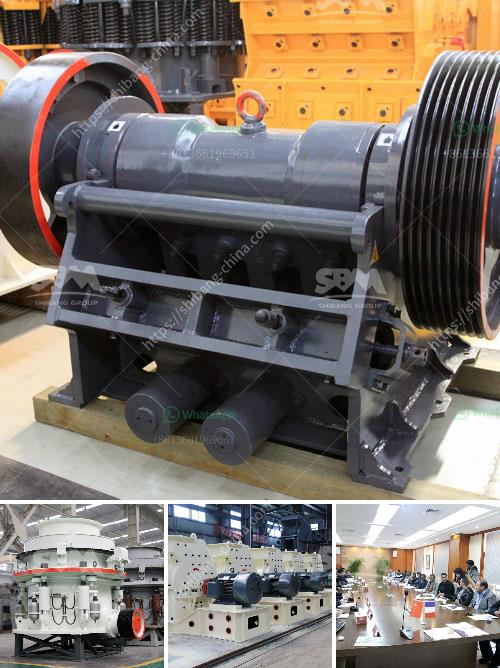

<h3>aggregate equipment for sale</h3>
Are you in the construction or mining industry and in need of aggregate equipment? Look no further, as we have a wide range of aggregate equipment for sale to meet all your needs. Whether you need crushers, screeners, or conveyors, we have the right equipment to help you increase productivity and efficiency on your job site.

Aggregate equipment is used to process various materials such as gravel, crushed stone, sand, and recycled concrete, among others. These materials are essential in the construction of roads, buildings, and other infrastructure projects. Without the right equipment, it can be challenging to process and produce high-quality aggregates, ultimately leading to delays and increased costs.

When it comes to selecting the right equipment, there are a few factors to consider. First and foremost, you need to assess your project's requirements and determine the capacity and size of the equipment you need. For instance, if you need to process a large volume of materials, a high-capacity crusher or screener would be suitable. On the other hand, if your project is smaller in scale, a compact crusher or screener would be more appropriate.

Additionally, it is crucial to choose equipment that is durable and reliable. You want equipment that can withstand the demands of your job site and operate efficiently for extended periods. Look for equipment made from high-quality materials and built by reputable manufacturers to ensure longevity and performance.

Finally, consider the maintenance and service requirements of the equipment you are considering. Regular maintenance and timely repairs are essential to keep your aggregate equipment running smoothly. Opt for equipment that is easy to maintain and has readily available spare parts.

At our company, we take pride in offering a wide range of aggregate equipment for sale, including crushers, screeners, and conveyors. Our equipment is manufactured by industry-leading brands and is designed to deliver exceptional performance and efficiency. Furthermore, we can assist you in choosing the most suitable equipment for your specific needs and provide ongoing support and service.

In conclusion, whether you need to process gravel, crushed stone, or sand, having the right aggregate equipment is crucial to the success of your construction or mining project. Consider factors such as capacity, durability, and maintenance requirements when selecting equipment. Our company offers a comprehensive range of aggregate equipment for sale, ensuring you can find the right equipment to meet your needs. Contact us today to learn more and find the perfect equipment for your job site.
<h3>Contact us</h3><ul><li><strong>Whatsapp:&nbsp;<a href="https://wa.me/8613661969651">+8613661969651</a></strong></li><li><a href="https://swt.shibang-china.com/?git&amp;zhl&amp;aggregate equipment for sale"><strong>Online Service(chat now)</strong></a></li></ul><h3>Related</h3><ul><li><a href='ball mill project.md'>ball mill project</a></li><li><a href='stone crusher mesin malaysia.md'>stone crusher mesin malaysia</a></li><li><a href='grinding mill for quartz in to 500 mesh in india.md'>grinding mill for quartz in to 500 mesh in india</a></li><li><a href='alluvial chrome wash plant in zimbabwe.md'>alluvial chrome wash plant in zimbabwe</a></li><li><a href='basalt processing plant.md'>basalt processing plant</a></li></ul>