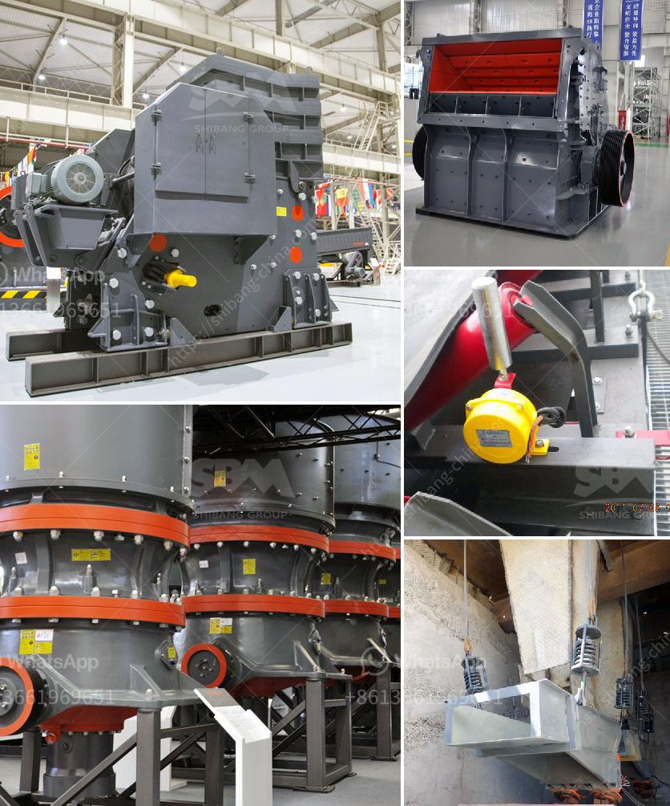

<h3>aggregate machinery</h3>
Aggregate machinery refers to the equipment used in the mining and construction industry to process and crush large stones and rocks into smaller pieces. This type of machinery plays a crucial role in various operations, including the production of concrete, asphalt, and other construction materials.

One of the primary functions of aggregate machinery is to break down large materials into smaller sizes for easy transportation and handling. These machines are equipped with powerful crushers that exert enormous force on the rocks, efficiently reducing their size. This process enhances the workability of the material and enables it to be used in various construction applications.

In addition to crushing, aggregate machinery is also responsible for screening and separating different sizes of material. The screening process helps to ensure that the final product meets the desired specifications. By using different screens and classifiers, the machinery can segregate the material into different sizes, allowing it to be used for specific construction purposes.

Another significant advantage of aggregate machinery is its ability to recycle and reuse materials. Many machines are equipped with advanced technologies that can process and reuse waste materials, such as concrete and asphalt. This not only reduces the need for new materials but also contributes to sustainable construction practices.

Furthermore, aggregate machinery is designed to withstand harsh working conditions. These heavy-duty machines are built to handle large volumes of material and operate continuously, even in challenging environments. Their robust construction ensures durability and longevity, minimizing downtime and maximizing productivity.

As technology continues to advance, aggregate machinery has seen significant improvements in terms of efficiency and performance. Modern machines are equipped with sophisticated features and automation systems that optimize operations and enhance productivity.

In conclusion, aggregate machinery is a crucial component of the mining and construction industry. With its ability to crush, screen, and separate materials, it plays a vital role in producing various construction materials and recycling waste products. As technology continues to evolve, the efficiency and capabilities of these machines are only expected to increase, further contributing to the growth of the industry.
<h3>Contact us</h3><ul><li><strong>Whatsapp:&nbsp;<a href="https://wa.me/8613661969651">+8613661969651</a></strong></li><li><a href="https://swt.shibang-china.com/?git&amp;zhl&amp;aggregate machinery"><strong>Online Service(chat now)</strong></a></li></ul><h3>Related</h3><ul><li><a href='gypsum milling prices in kenya.md'>gypsum milling prices in kenya</a></li><li><a href='crushing and screening plant for sale.md'>crushing and screening plant for sale</a></li><li><a href='how much does ball mill cost.md'>how much does ball mill cost</a></li><li><a href='slag grinding process.md'>slag grinding process</a></li><li><a href='high efficient grinding mills for sale.md'>high efficient grinding mills for sale</a></li></ul>