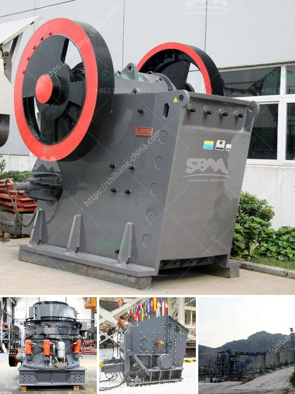

<h3>aggregate washing plant cost</h3>
Aggregate washing plant cost is a crucial consideration when it comes to purchasing an efficient and effective plant for your construction project. The initial investment will be a key factor influencing your decision, as it will determine whether you can afford the plant or not. However, the cost is not the only factor you should consider, as the efficiency and durability of the plant will also impact its long-term cost.

The cost of an aggregate washing plant can vary greatly depending on the size and capacity of the plant, the type of machinery being used, and the geographical location of the plant. The average cost of a 150-200 ton per hour plant is around $1 million, while a 300 ton per hour plant can cost upwards of $2 million.

One of the primary factors influencing the cost is the type of machinery and equipment used in the plant. High-quality machinery will generally come at a higher price, but its durability and efficiency will ensure lower maintenance and operational costs in the long run. It is therefore important to consider the quality and reliability of the machinery before making a purchase.

The geographical location of the plant can also impact the cost, as transportation expenses can vary greatly depending on the distance from the source of the raw materials and the construction site. It is advisable to choose a location that is closer to both the source and the site to minimize transportation costs.

In addition to the initial investment, it is also important to consider the operational costs of the plant. This includes factors such as electricity consumption, water usage, and maintenance expenses. Opting for a plant that is energy-efficient and has low water consumption can significantly reduce operational costs in the long run.

In conclusion, the cost of an aggregate washing plant should not be the sole factor influencing your decision. It is important to consider the efficiency, durability, and operational costs of the plant to ensure a cost-effective and successful construction project.
<h3>Contact us</h3><ul><li><strong>Whatsapp:&nbsp;<a href="https://wa.me/8613661969651">+8613661969651</a></strong></li><li><a href="https://swt.shibang-china.com/?git&amp;zhl&amp;aggregate washing plant cost"><strong>Online Service(chat now)</strong></a></li></ul><h3>Related</h3><ul><li><a href='kaolin crusher processing plant.md'>kaolin crusher processing plant</a></li><li><a href='complete crusher plant for sale.md'>complete crusher plant for sale</a></li><li><a href='hammer mill technical specification.md'>hammer mill technical specification</a></li><li><a href='project cost of mini cement plant in india.md'>project cost of mini cement plant in india</a></li><li><a href='jaw crusher vibration analysis pdf.md'>jaw crusher vibration analysis pdf</a></li></ul>