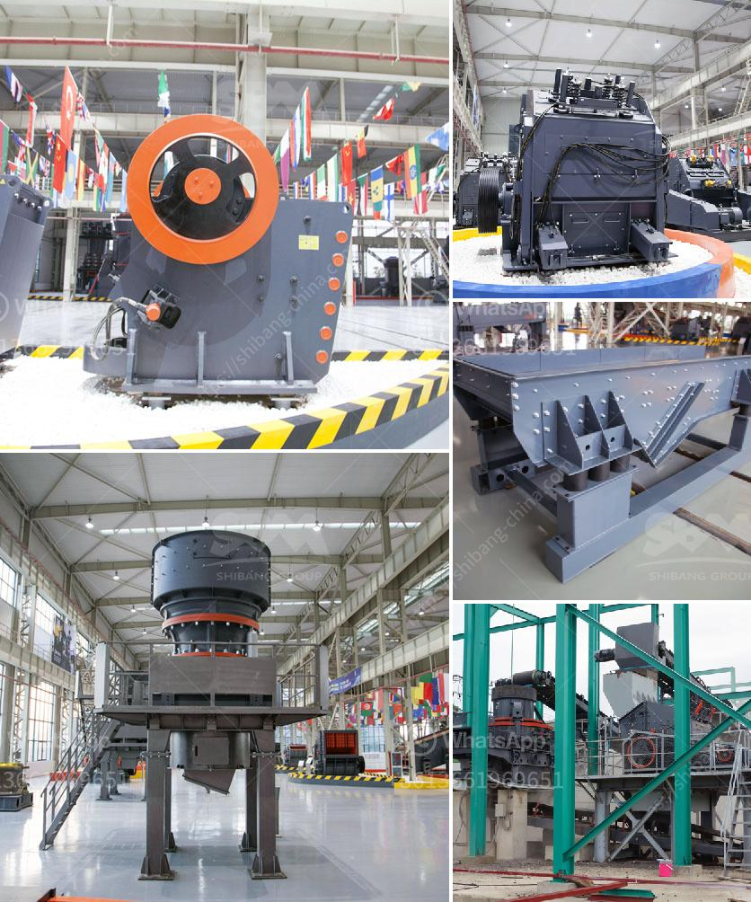

<h3>aggregates crusher plant for sale in south africa</h3>
Aggregates are the raw materials used in construction, widely used in highways, railways, airports, buildings, and other construction projects. South Africa in recent years has been a significant increase in the development of infrastructure projects, increasing the demand for aggregates. Crusher plant is the key equipment in aggregate production. In mining operations, the proper use of crusher plant can greatly improve the production efficiency and product quality.

Crusher plant is widely used in South Africa mining industry. In recent years, as the rapid development of the country's construction and infrastructure projects, the market demand for sand and gravel aggregates is increasing. Recently, a quarry plant in South Africa has been set up to process granite into aggregate products, as well as sand, which has become the focus of many investors.

First of all, granite is evenly sent to the vibrating feeder through the hopper, and processed by the crushing and screening machine of a cone crusher and a vertical shaft impact crusher. The cone crusher uses a laminating crushing method to change the final product grading shape, and reduces the wear of the vulnerable parts, making it more economical and efficient. The vertical shaft impact crusher produces a more ideal aggregate particle size with good shape and uniform grading, which is loved by the construction industry.

After the primary crushing stage, the materials are transported to the vibrating screen for sieving. Different specifications of aggregate products need to be sorted out. Then the materials that meet the specifications are transported to the finished product area through a conveyor belt for stacking. The oversized materials are returned to the crusher for reprocessing, thus ensuring the overall production efficiency of the aggregates crusher plant.

In addition, the South African government has been emphasizing the construction of infrastructure, promoting urbanization, and stimulating economic growth. The development of the aggregates industry is closely related to economic development. Therefore, the investment in aggregates crusher plant for sale is an important part of South Africa's construction industry. This is just in line with our goals and aims. It is very important to choose a suitable and efficient crusher plant.

The key to success lies in the selection of the right equipment for the application. It is important to be well-informed about the different types of crushers available in the market before making a purchase. Some considerations to be taken into account include the capacity, power requirements, and maintenance requirements of the crusher plant. It is also important to consider the long-term potential of the crusher plant, as an investment for future growth.

In conclusion, the aggregates crusher plant for sale in South Africa is an important part of the infrastructure and construction industry. The investment in the aggregates industry is an important source of employment and economic growth. Therefore, the South African government has been advocating for more investment in this industry. In order to choose the right crusher plant for sale, it is important to consider these factors: capacity, power requirements, maintenance costs, and long-term potential.
<h3>Contact us</h3><ul><li><strong>Whatsapp:&nbsp;<a href="https://wa.me/8613661969651">+8613661969651</a></strong></li><li><a href="https://swt.shibang-china.com/?git&amp;zhl&amp;aggregates crusher plant for sale in south africa"><strong>Online Service(chat now)</strong></a></li></ul><h3>Related</h3><ul><li><a href='cost of setting up quarry plant in nigeria.md'>cost of setting up quarry plant in nigeria</a></li><li><a href='jaw crusher grinding.md'>jaw crusher grinding</a></li><li><a href='high grinding mill quicklime.md'>high grinding mill quicklime</a></li><li><a href='mobile aggregates washing plant.md'>mobile aggregates washing plant</a></li><li><a href='ball mills for clay.md'>ball mills for clay</a></li></ul>