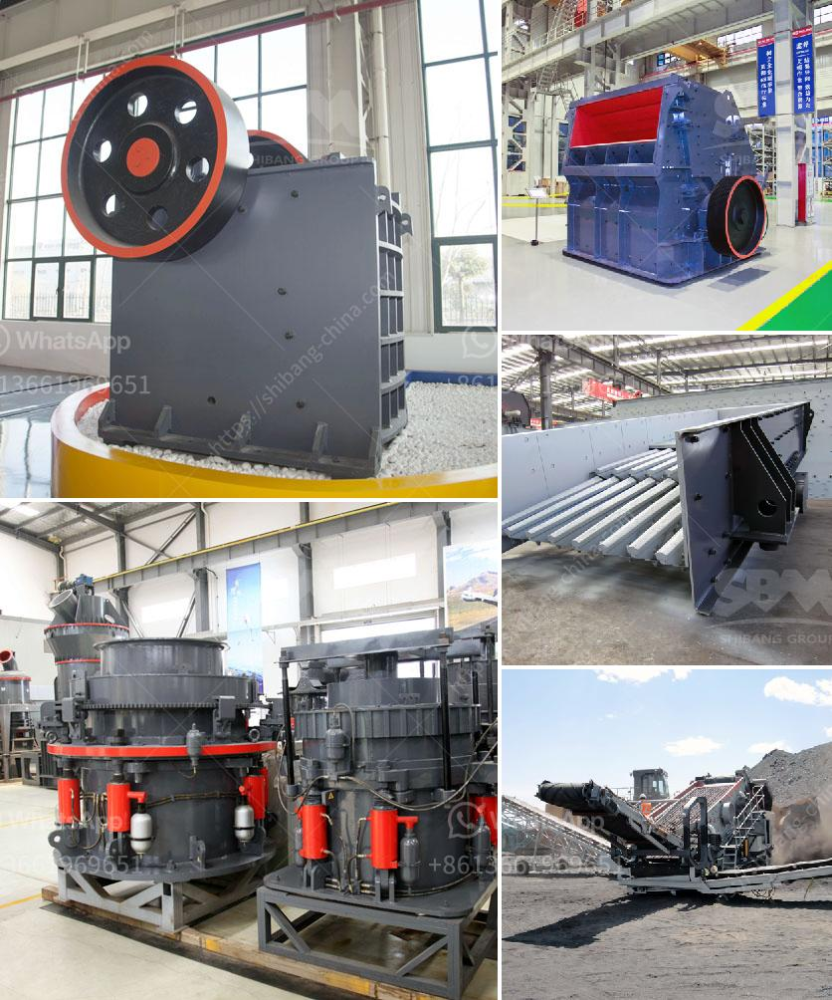

<h3>aggregates for concrete crusher in nigeria</h3>
Aggregates are a fundamental ingredient in concrete production. Over the years, the demand for construction aggregates in Nigeria has been on the rise, and this is due to the growth in the construction industry. In order to meet this high demand, there has been a significant increase in the number of stone-crushing companies in Nigeria.

These companies crush stones, rocks, granite, and other types of stones into different sizes for use in various construction projects. For instance, crushed stones are used for making different types of concrete products, road base, asphalt and drainage systems. In recent years, Nigeria's demand for aggregates for concrete crusher in Nigeria has increased tremendously because of the rapid growth of the construction industry.

As stated earlier, the construction industry in Nigeria has experienced rapid growth due to the increase in population, urbanization, and infrastructure development projects. This has led to a high demand for aggregates for concrete crusher in Nigeria. To meet this increasing demand, stone-crushing companies have invested in large-scale production plants.

The main source of aggregates is natural deposits. These deposits are formed over millions of years by weathering of rocks and erosion. However, the extraction of aggregates from natural deposits can be challenging and costly. In addition, it can have adverse effects on the environment, such as deforestation, soil erosion, and habitat destruction.

To address these challenges, stone-crushing companies in Nigeria have been adopting advanced technology and equipment to increase their production capacity. One such technology is the use of mobile crushing plants. These plants can be easily transported to different locations and provide an efficient solution for crushing rocks and stones on-site.

Using aggregates from concrete crusher in Nigeria is also an environmentally friendly option. According to the Nigerian Geological Survey Agency, the majority of natural aggregates used in Nigeria are obtained from riverbeds and coastal areas. This extraction method has a high negative impact on the environment. By using aggregates from concrete crusher, companies can reduce the need for extraction from natural deposits, thereby preserving the environment.

In conclusion, aggregates for concrete crusher in Nigeria are essential for the construction industry. They are used as a foundational material in buildings, roads, highways, and other infrastructural projects. The high demand for aggregates in Nigeria has led to the emergence of stone-crushing companies who provide high-quality aggregates that are suitable for concrete production. Additionally, the use of aggregates from concrete crushers in Nigeria is environmentally friendly as it reduces the need for extraction from natural deposits. Overall, the market for aggregates in Nigeria is poised for growth as the construction industry continues to expand.
<h3>Contact us</h3><ul><li><strong>Whatsapp:&nbsp;<a href="https://wa.me/8613661969651">+8613661969651</a></strong></li><li><a href="https://swt.shibang-china.com/?git&amp;zhl&amp;aggregates for concrete crusher in nigeria"><strong>Online Service(chat now)</strong></a></li></ul><h3>Related</h3><ul><li><a href='mobile rock crushing plant nigeria.md'>mobile rock crushing plant nigeria</a></li><li><a href='gypsum production in visakhapatnam.md'>gypsum production in visakhapatnam</a></li><li><a href='ball mill balls suppliers.md'>ball mill balls suppliers</a></li><li><a href='nigeria vertical mill machine.md'>nigeria vertical mill machine</a></li><li><a href='crusher machine suppliers.md'>crusher machine suppliers</a></li></ul>