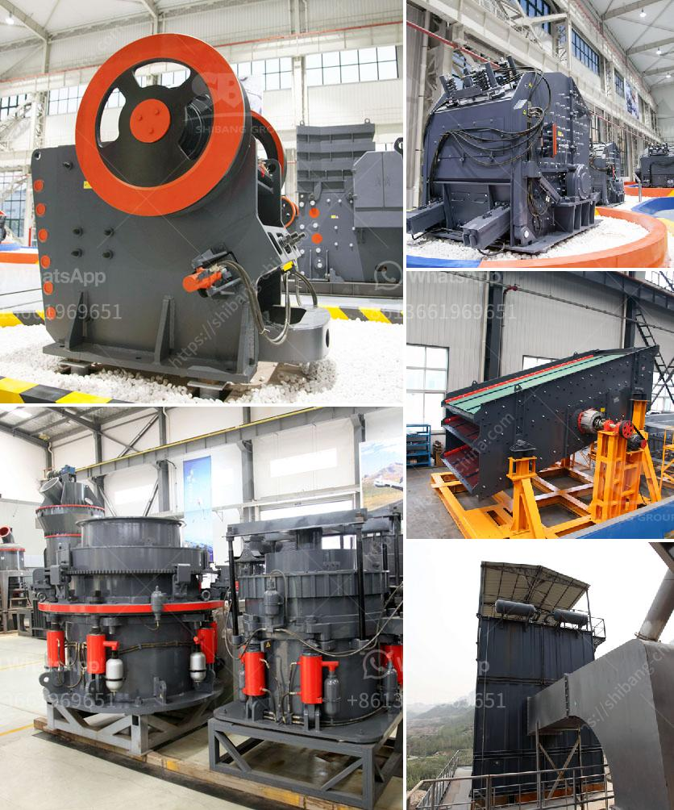

<h3>all quarries crushing plants</h3>
In the vast realm of construction, quarries crushing plants play a crucial role. These plants provide the essential materials needed to build roads, bridges, highways, schools, hospitals, and various structures that support our modern society. Let's delve into the world of quarries crushing plants and explore their significance in shaping our infrastructure.

Quarries, also known as open-pit mines, are natural reserves of various minerals and materials. These reserves include limestone, granite, marble, sand, gravel, and more. To extract these resources, quarries utilize heavy machinery and explosives to blast through rock formations, creating large pieces of materials that can be processed.

Once extracted, the materials undergo a crushing process in specialized plants. These crushing plants are equipped with powerful machines that break down the raw materials into smaller, manageable sizes. The primary crusher, which is typically a jaw crusher or a gyratory crusher, reduces the material's size further, making it suitable for subsequent processing.

The secondary crushers, like impact crushers or cone crushers, further refine the material. They ensure uniformity in size and shape, promoting better performance during its application in construction projects. These crushers have various adjustable settings that allow for customization based on specific requirements.

Moreover, screening equipment is an integral part of quarries crushing plants. It sifts through the crushed material, separating it into different sizes. This process plays a crucial role in quality control. The properly sized material is used for construction purposes, while undesired materials, like fines, are discarded or used in other applications.

The materials produced by quarries crushing plants are indispensable in construction projects. Limestone and granite, for example, are essential for building strong foundations and for creating durable structures like roads, bridges, and buildings. Sand and gravel, on the other hand, are used in concrete production, which serves as the backbone of the construction industry.

Not only do quarries crushing plants provide the necessary materials, but they also offer economic benefits to local communities. These plants create employment opportunities, stimulating the local economy. Additionally, quarries often collaborate with neighboring communities to ensure responsible and sustainable mining practices.

The impact of quarries crushing plants extends beyond construction. They contribute to environmental conservation as well. Many plants focus on reducing their carbon footprint by implementing sustainable practices, such as using alternative energy sources and recycling water.

However, it's important to note that quarries crushing plants must operate responsibly and adhere to strict regulations. They must ensure proper dust control, noise reduction, and rehabilitation of the area after extraction. This prevents any potential negative impacts on the environment and nearby communities.

In conclusion, quarries crushing plants are the backbone of construction. These facilities extract natural resources and process them into suitable materials for building infrastructure. They contribute to economic growth, create employment opportunities, and promote sustainable practices. It's essential for all stakeholders to support and encourage responsible operations in these crucial facilities.
<h3>Contact us</h3><ul><li><strong>Whatsapp:&nbsp;<a href="https://wa.me/8613661969651">+8613661969651</a></strong></li><li><a href="https://swt.shibang-china.com/?git&amp;zhl&amp;all quarries crushing plants"><strong>Online Service(chat now)</strong></a></li></ul><h3>Related</h3><ul><li><a href='stone crusher aggregate supplier kota.md'>stone crusher aggregate supplier kota</a></li><li><a href='iron ore beneficiation plants price in china.md'>iron ore beneficiation plants price in china</a></li><li><a href='crusher industrial jaw crusher information.md'>crusher industrial jaw crusher information</a></li><li><a href='stone crushing machinery suppliers.md'>stone crushing machinery suppliers</a></li><li><a href='india copper mining equipment.md'>india copper mining equipment</a></li></ul>