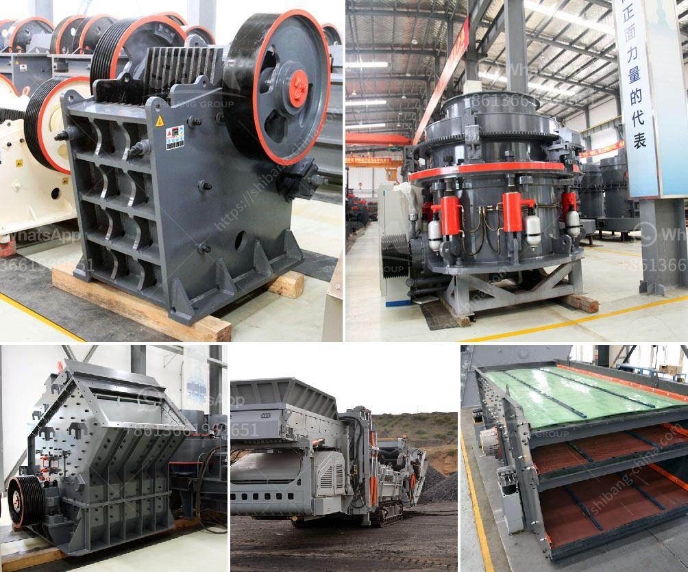

<h3>alluvial chrome wash plant in zimbabwe</h3>
Alluvial chrome wash plant in Zimbabwe is widely utilized in the mining industry. It has become the most successful method to remove and recover chrome from various kinds of soil and rocks. It is also eco-friendly, as it does not require the use of toxic chemicals or mercury.

The alluvial chrome wash plant mainly consists of a hopper, trommel screen, spiral chute, vibrating screen, shaking table, slurry pump, water pump, diesel generator, and electrostatic separator. These equipment have different functions and work together to extract chrome efficiently.

The process begins with the feeding of the raw materials into the hopper by a front-end loader. The hopper has a grizzly screen that segregates larger rocks and stone from the finer material. The rocks are removed, while the finer material passes through the trommel screen.

The trommel screen performs a vital role in the chrome wash plant. Its purpose is to separate the chrome ore particles from the unwanted soil and rocks. The rotating drum of the trommel screen constantly lifts the material up and drops it onto the screen, allowing the smaller particles to pass through the mesh while larger particles are retained.

Once the chrome ore particles are separated, they are transported onto a spiral chute. The spiral chute is a gravity separation device that utilizes the principle of centrifugal force to separate minerals based on their specific gravity. The chrome ore particles with higher density will move towards the inner wall of the spiral chute, while those with lower density will move towards the outer edge.

The vibrating screen is then used to further separate the chrome ore particles. It is equipped with multiple screens of different sizes to ensure that the desired size range is obtained. The vibrating screen efficiently removes any oversized particles or debris, resulting in a more refined product.

The next step in the process is the application of a shaking table. The shaking table utilizes the principle of differential motion to separate the chrome ore particles based on their specific gravity and shape. The table is equipped with riffles that trap the heavier particles, allowing the lighter particles to flow down the table.

At this stage, the chrome ore particles are suspended in a slurry and transferred using a slurry pump. The slurry pump ensures the smooth and efficient transport of the ore particles from one process to another.

To further refine the chrome concentrate, a water pump is used to create a continuous flow of water. The water removes any impurities or unwanted materials, resulting in a clean and high-quality chrome concentrate.

Finally, an electrostatic separator is used to recover and separate any remaining minerals and impurities. The electrostatic separator utilizes the principle of electrostatic attraction to separate charged particles. It ensures that the final chrome concentrate is of the highest quality.

Overall, the alluvial chrome wash plant in Zimbabwe is an efficient and environmentally friendly method to extract and recover chrome from various soil and rocks. It offers a cost-effective solution to the mining industry and helps to enhance the productivity and profitability of chrome mining operations in Zimbabwe.
<h3>Contact us</h3><ul><li><strong>Whatsapp:&nbsp;<a href="https://wa.me/8613661969651">+8613661969651</a></strong></li><li><a href="https://swt.shibang-china.com/?git&amp;zhl&amp;alluvial chrome wash plant in zimbabwe"><strong>Online Service(chat now)</strong></a></li></ul><h3>Related</h3><ul><li><a href='coal wash plants for sale in malaysia.md'>coal wash plants for sale in malaysia</a></li><li><a href='cement plant process in south africa.md'>cement plant process in south africa</a></li><li><a href='vertical ball mills.md'>vertical ball mills</a></li><li><a href='grinding mill usa.md'>grinding mill usa</a></li><li><a href='india copper mining equipment.md'>india copper mining equipment</a></li></ul>