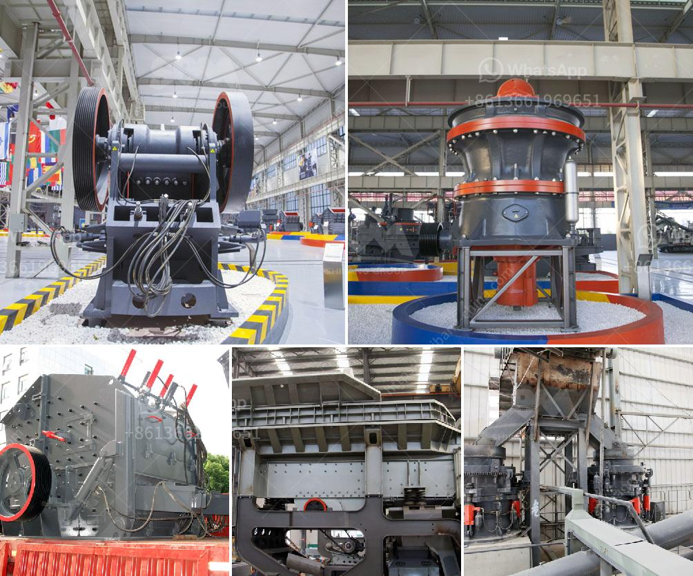

<h3>alluvial diamond processing plant container for sale</h3>
Alluvial diamond processing plants have proven to be efficient and effective in recovering diamonds from various sources. These plants are designed to receive alluvial diamond bearing material that has been excavated and transported to a secure location. The alluvial diamond processing plant container for sale is a versatile solution that can be used as a stationary or semi-mobile unit, depending on the site requirements.

One of the key advantages of this containerized plant is its compact design. The entire plant is housed within a standard shipping container, which makes it easy to transport and install in remote and challenging locations. This eliminates the need for extensive civil works and reduces the associated costs and time.

The processing plant container is equipped with all the necessary equipment and systems for efficient diamond recovery. This includes screens, scrubbers, dense media separation (DMS) units, and X-ray sorting machines. These components work together to separate the diamond-bearing material from the rest of the feed and ensure that the valuable diamonds are recovered.

In addition to its efficient diamond recovery capabilities, the containerized plant also incorporates advanced technology for material handling and water recycling. The plant is designed to minimize environmental impact by recycling water used in the processing and by managing tailings responsibly.

The alluvial diamond processing plant container for sale is not limited to a particular scale of operation. It can handle various capacities, ranging from small-scale operations requiring a few tonnes of feed material per hour to large-scale operations handling hundreds of tonnes per hour.

Overall, the alluvial diamond processing plant container for sale offers a cost-effective and efficient solution for diamond recovery. Its compact design, versatility, and advanced technology make it a valuable asset for diamond mining operations worldwide. Whether used as a permanent solution or a temporary setup, this containerized plant can deliver consistent and reliable results in the recovery of alluvial diamonds.
<h3>Contact us</h3><ul><li><strong>Whatsapp:&nbsp;<a href="https://wa.me/8613661969651">+8613661969651</a></strong></li><li><a href="https://swt.shibang-china.com/?git&amp;zhl&amp;alluvial diamond processing plant container for sale"><strong>Online Service(chat now)</strong></a></li></ul><h3>Related</h3><ul><li><a href='business plan for coal processing.md'>business plan for coal processing</a></li><li><a href='desain conveyor belt di tambang batu bara.md'>desain conveyor belt di tambang batu bara</a></li><li><a href='industrial conveyor belts dimensions.md'>industrial conveyor belts dimensions</a></li><li><a href='how to start a rock quarry business.md'>how to start a rock quarry business</a></li><li><a href='gold crushers sale.md'>gold crushers sale</a></li></ul>