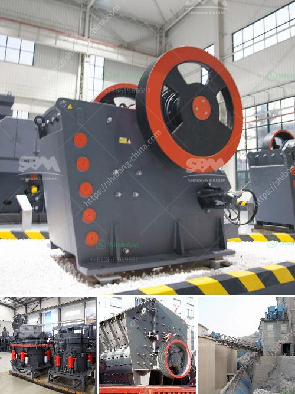

<h3>alluvial wash plants in south africa</h3>
Alluvial wash plants, also known as placer mining wash plants, are specifically designed for the recovery of alluvial gold and other precious metals and minerals. They are ideal for extracting gold, diamonds, gemstones, and other heavy minerals from placer deposits found in river beds and streams in South Africa.

South Africa is renowned for its abundance of mineral resources, particularly gold, which has been a valuable asset for the country for centuries. The Witwatersrand Basin, located in Gauteng province, is home to some of the world's deepest and richest gold mines. However, in recent years, the focus has shifted to alluvial gold mining due to the declining grades and depths of underground mines.

Alluvial wash plants play a crucial role in the gold mining industry. They utilize various techniques and equipment such as feed hoppers and conveyors to efficiently transport the ore to the wash plant and ensure its proper separation and classification. The alluvial material undergoes a series of processes, including scrubbing, screening, gravity separation, and sometimes even flotation or leaching, depending on the nature of the ore.

The effectiveness of alluvial wash plants lies in their ability to recover fine gold particles and other minerals that can be easily lost during traditional mining methods. The use of sophisticated equipment like trommels, jigs, sluice boxes, and centrifugal concentrators ensures high recovery rates and efficient operations. Moreover, these wash plants are highly mobile and can be easily transported to different mining sites, allowing miners to follow and exploit the richest alluvial deposits.

South Africa is recognized as a global leader in the field of alluvial mining, thanks to its vast mineral wealth and advanced mining technologies. The country boasts several companies specialized in manufacturing and supplying alluvial wash plants to the mining industry. These plants are tailored to meet the specific requirements and conditions of South Africa's unique alluvial deposits, ensuring optimal performance and maximum yields.

In conclusion, alluvial wash plants in South Africa are vital tools for extracting gold and other valuable minerals from alluvial deposits. They offer efficient and cost-effective solutions for miners looking to capitalize on the country's abundant mineral resources. These wash plants, combining advanced technologies and innovative designs, continue to contribute to South Africa's rich mining heritage and economic growth.
<h3>Contact us</h3><ul><li><strong>Whatsapp:&nbsp;<a href="https://wa.me/8613661969651">+8613661969651</a></strong></li><li><a href="https://swt.shibang-china.com/?git&amp;zhl&amp;alluvial wash plants in south africa"><strong>Online Service(chat now)</strong></a></li></ul><h3>Related</h3><ul><li><a href='mobile crusher price malaysia.md'>mobile crusher price malaysia</a></li><li><a href='sand crusher cost.md'>sand crusher cost</a></li><li><a href='used quarry equipment for sale in calgary canada.md'>used quarry equipment for sale in calgary canada</a></li><li><a href='how to start a rock quarry business.md'>how to start a rock quarry business</a></li><li><a href='gold mobile crushing equipment.md'>gold mobile crushing equipment</a></li></ul>