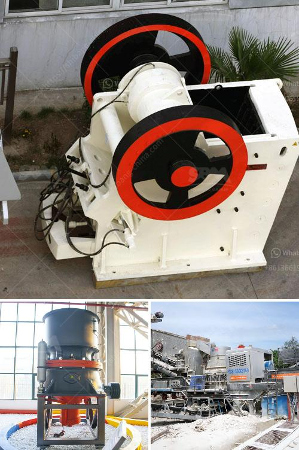

<h3>application procedure for ball mill</h3>
The ball mill application procedure is not difficult. You should follow the principle and guidelines to achieve the most satisfactory result.

First of all, you should select the appropriate size and model of the ball mill. Your selection should be based on the specific requirements of the project and the characteristics of the material. In general, larger ball mills are suitable for grinding larger materials, while smaller ones are better for grinding finer materials.

Once you have chosen the right ball mill, you need to install it properly. Make sure to read the instruction manual carefully and follow the steps accordingly. It is important to ensure that all the components are properly aligned and tightened. This will help in preventing any accidents or damage during operation.

Before starting the ball mill, you need to check the lubrication system and make sure it is functioning properly. The lubrication system should be filled with the appropriate lubricants to reduce friction and prevent wear and tear.

Once everything is in order, you can start the ball mill. Make sure to operate it at the recommended speed and load. Overloading the ball mill can cause damage to the components and reduce its efficiency. So, it is essential to follow the recommended guidelines.

During the operation, you should regularly monitor the performance of the ball mill. Check for any abnormal vibrations, noises, or overheating. If you notice any of these issues, stop the mill immediately and investigate the cause. Continuing the operation with these problems can lead to severe damage and increase the downtime.

After the operation, it is essential to clean the ball mill thoroughly. Remove any remaining material or debris to prevent clogging and contamination. Additionally, regularly inspect and maintain the ball mill to ensure its optimal performance.

In conclusion, the application procedure for a ball mill is a step-by-step process that requires careful attention to detail and adherence to the manufacturer's guidelines. By following the correct procedure, you can optimize the performance of the ball mill and prolong its lifespan.
<h3>Contact us</h3><ul><li><strong>Whatsapp:&nbsp;<a href="https://wa.me/8613661969651">+8613661969651</a></strong></li><li><a href="https://swt.shibang-china.com/?git&amp;zhl&amp;application procedure for ball mill"><strong>Online Service(chat now)</strong></a></li></ul><h3>Related</h3><ul><li><a href='quarry stone crushing machine manufacturers.md'>quarry stone crushing machine manufacturers</a></li><li><a href='china coal crusher high capacity.md'>china coal crusher high capacity</a></li><li><a href='used crushers sale usa.md'>used crushers sale usa</a></li><li><a href='roller crusher for sale gumtree.md'>roller crusher for sale gumtree</a></li><li><a href='dolomite powder mill machinery.md'>dolomite powder mill machinery</a></li></ul>