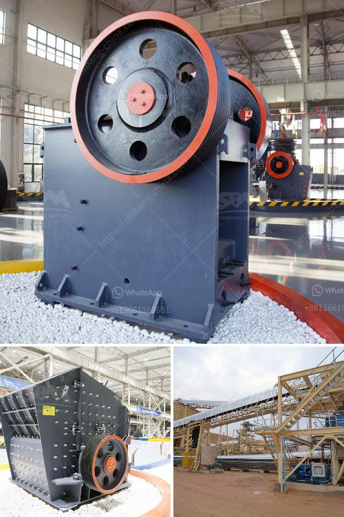

<h3>ash grinding machine</h3>
Ash grinding machines are modern devices that use technological advancements to pulverize ash efficiently. These machines have made ash disposal much easier and cost-effective. In the past, disposing of ash was a cumbersome task that required manual labor and consumed a significant amount of time. However, with the advent of ash grinding machines, this process has become much more streamlined and convenient.

Ash grinding machines work by breaking down large chunks of ash into fine particles, making it easier to handle and dispose of. The machines utilize high-speed rotating blades that impact the ash and reduce its size. This pulverization process is crucial in industries where ash is a byproduct of combustion or other manufacturing processes.

One of the significant advantages of ash grinding machines is their efficiency. These machines can process large amounts of ash in a short amount of time, significantly reducing the time required for disposal. Furthermore, the fine particles produced by these machines can be easily transported and stored, further simplifying the disposal process.

Another benefit of ash grinding machines is their cost-effectiveness. By reducing the size of ash particles, these machines increase the ash's bulk density, making it possible to transport larger quantities in a single trip. This results in reduced transportation costs and minimizes the need for additional resources.

Ash grinding machines are also environmentally friendly. By reducing the size of ash particles, they decrease the volume of ash that needs to be disposed of, ultimately reducing the strain on landfills. Additionally, the fine particles produced during grinding can also be used in certain applications, such as construction materials or soil amendments, further reducing waste and promoting sustainability.

In conclusion, ash grinding machines have revolutionized the disposal process of ash by simplifying it, reducing costs, and improving efficiency. These machines are essential in industries where ash is a byproduct and help in achieving sustainable waste management practices. With advancements in technology, it is expected that ash grinding machines will continue to play a critical role in ash disposal and contribute to a cleaner and greener future.
<h3>Contact us</h3><ul><li><strong>Whatsapp:&nbsp;<a href="https://wa.me/8613661969651">+8613661969651</a></strong></li><li><a href="https://swt.shibang-china.com/?git&amp;zhl&amp;ash grinding machine"><strong>Online Service(chat now)</strong></a></li></ul><h3>Related</h3><ul><li><a href='spare parts rollers xzm ultrafine mill.md'>spare parts rollers xzm ultrafine mill</a></li><li><a href='models of ball mills.md'>models of ball mills</a></li><li><a href='cone crusher second hand for sale in south africa.md'>cone crusher second hand for sale in south africa</a></li><li><a href='river sand mining machine for sale.md'>river sand mining machine for sale</a></li><li><a href='mining industry in mpumalanga.md'>mining industry in mpumalanga</a></li></ul>