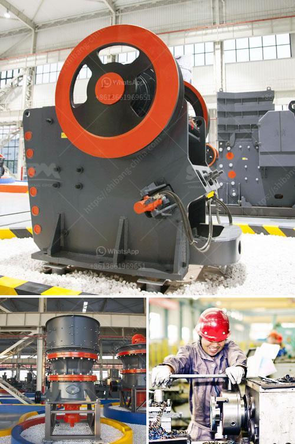

<h3>ball mill balls suppliers</h3>
Ball mill balls suppliers play a significant role in the manufacturing process of various industries. They are responsible for supplying top-quality balls that are used in ball mills for grinding and milling applications.

These grinding media balls are manufactured from durable and high-quality materials. They are precisely engineered to withstand the extreme wear and tear encountered during the grinding process. The suppliers ensure that the balls meet industry standards and are suitable for specific applications, enhancing the overall efficiency and performance of the ball mills.

Ball mill balls suppliers offer a wide range of choices to cater to different industries' needs. These suppliers are well-versed in understanding the varying requirements of different industries and provide balls with varying hardness levels, sizes, and materials. They supply forged steel balls, cast iron balls, ceramic balls, and many other types of balls suitable for diverse applications.

The suppliers focus on delivering balls that exhibit excellent resistance to abrasion and impact, ensuring prolonged service life. They understand that the grinding media balls should have the perfect balance between hardness and toughness to withstand the high stress and pressure exerted inside the ball mills.

The suppliers also offer customization options to fulfill specific requirements. Whether it is the size, material, or hardness, they provide tailored solutions to meet individual needs. Additionally, the suppliers conduct extensive quality control procedures to guarantee that the balls adhere to the highest standards.

In conclusion, ball mill balls suppliers are essential partners in the manufacturing process. They ensure the supply of high-quality grinding media balls that are fundamental for the efficient functioning of ball mills. Their expertise in understanding different industry requirements and delivering customized solutions makes them invaluable to various sectors.
<h3>Contact us</h3><ul><li><strong>Whatsapp:&nbsp;<a href="https://wa.me/8613661969651">+8613661969651</a></strong></li><li><a href="https://swt.shibang-china.com/?git&amp;zhl&amp;ball mill balls suppliers"><strong>Online Service(chat now)</strong></a></li></ul><h3>Related</h3><ul><li><a href='grinding ball mill price.md'>grinding ball mill price</a></li><li><a href='how much to set up a granite crushing plant.md'>how much to set up a granite crushing plant</a></li><li><a href='products pe jaw crusher.md'>products pe jaw crusher</a></li><li><a href='mobile crushing and screening manufacturer in india.md'>mobile crushing and screening manufacturer in india</a></li><li><a href='cobalt ore processing plant setup cost.md'>cobalt ore processing plant setup cost</a></li></ul>