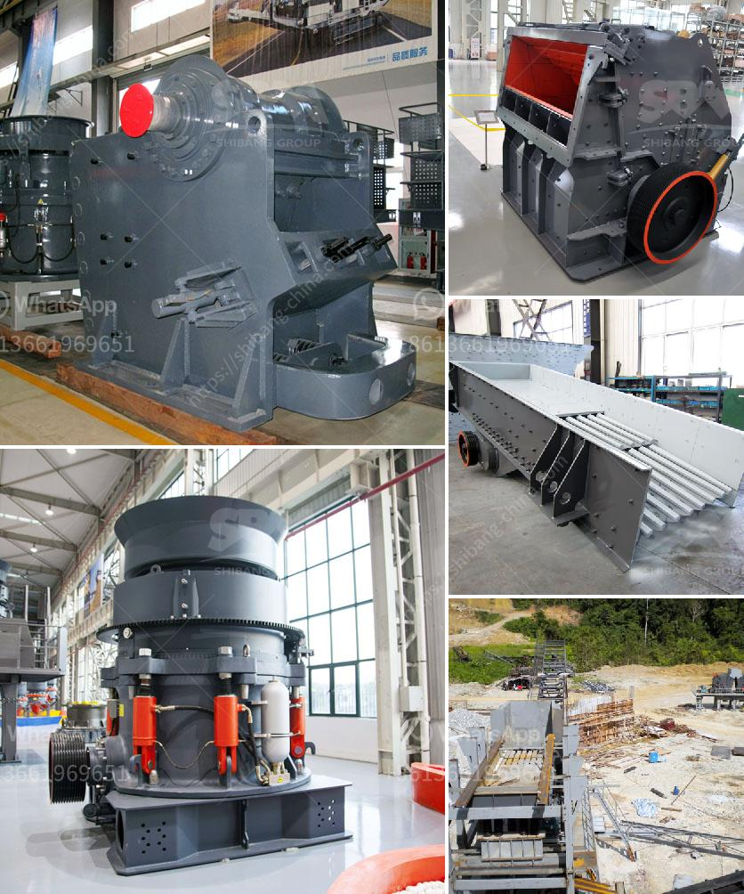

<h3>ball mill brochure eccentric outer cone crusher</h3>
The ball mill brochure eccentric outer cone crusher is a powerful machine that helps in crushing raw materials into smaller pieces for further processing. This machine has an eccentric outer cone that gyrates against the stationary inner cone, crushing the raw materials between them.

The ball mill brochure eccentric outer cone crusher is commonly used in mining, metallurgy, construction, road building, chemical and silicate industries. It is suitable for crushing various ores and rocks with medium hardness and above. Its unique design allows for high crushing efficiency and low operating costs.

One of the key features of the ball mill brochure eccentric outer cone crusher is its large crushing ratio. This means that it can crush large-sized materials into smaller pieces with ease. It also has a wide range of applications, as it can be used for primary, secondary, and tertiary crushing.

The eccentric outer cone crusher consists of a crushing cone, an eccentric sleeve, a driving shaft, and a hydraulic system. The crushing cone is made of high-quality manganese steel, which ensures its durability and long service life. The eccentric sleeve is driven by the driving shaft, causing the crushing cone to rotate eccentrically.

The hydraulic system of the ball mill brochure eccentric outer cone crusher is responsible for adjusting the size of the discharge opening. This allows for precise control over the final product size. The hydraulic system also helps in protecting the crusher from damage due to overload or tramp iron.

In addition to its powerful crushing capabilities, the ball mill brochure eccentric outer cone crusher also offers other benefits. It has a compact design, which makes it easy to install and operate. It has a low noise level, ensuring a comfortable working environment. The machine is also energy-efficient, reducing running costs and environmental impact.

To ensure optimal performance, regular maintenance is crucial for the ball mill brochure eccentric outer cone crusher. It is important to inspect and replace worn-out parts, such as the crushing cone and the eccentric sleeve. Proper lubrication of the machine is also necessary to prevent excessive wear and tear.

Overall, the ball mill brochure eccentric outer cone crusher is a reliable and efficient machine for crushing raw materials. Its unique design, high crushing ratio, and wide range of applications make it a valuable tool in various industries. With proper maintenance and care, this machine can deliver consistent and high-quality output for many years.
<h3>Contact us</h3><ul><li><strong>Whatsapp:&nbsp;<a href="https://wa.me/8613661969651">+8613661969651</a></strong></li><li><a href="https://swt.shibang-china.com/?git&amp;zhl&amp;ball mill brochure eccentric outer cone crusher"><strong>Online Service(chat now)</strong></a></li></ul><h3>Related</h3><ul><li><a href='pulverizer crusher machine manufacturers south africa.md'>pulverizer crusher machine manufacturers south africa</a></li><li><a href='business plan for stone crushing in kenya.md'>business plan for stone crushing in kenya</a></li><li><a href='lime stone crusher section in cement plant pdf.md'>lime stone crusher section in cement plant pdf</a></li><li><a href='chrome mining methods in zimbabwe.md'>chrome mining methods in zimbabwe</a></li><li><a href='manganese ore concentrate south africa.md'>manganese ore concentrate south africa</a></li></ul>