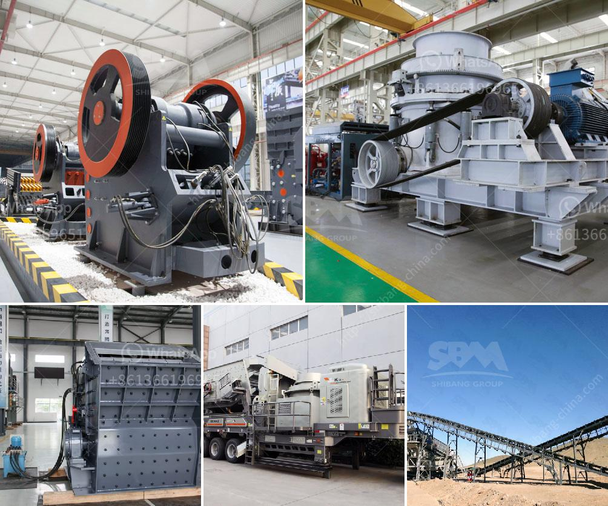

<h3>ball mill construction</h3>
Ball mill is a cylindrical device used to grind or mix materials like ores, chemicals, ceramic raw materials, and paints. It rotates around a horizontal axis, partially filled with the material to be ground plus the grinding medium. Different materials are used as media, including ceramic balls, flint pebbles, and stainless steel balls. An internal cascading effect reduces the material to a fine powder.

The basic construction of a ball mill consists of a metal cylinder usually made from steel, filled with a grinding medium, such as steel balls or flint pebbles, for crushing and grinding the material in the mill. The cylinder rotates around a horizontal axis. When the cylinder rotates, the grinding medium inside it creates an impacting and cascading motion that reduces the size of the material.

The size of the cylinder and the grinding medium used depend on the hardness of the material being processed. For example, for grinding hard ores, a larger cylinder and larger grinding media are used to ensure efficient grinding. On the other hand, for softer materials, a smaller cylinder and smaller grinding media are preferred.

The cylindrical shell of a ball mill is usually made of steel. It is lined with abrasion-resistant materials such as manganese steel or rubber to prevent wear and increase efficiency. The inner surface of the cylindrical shell is typically fitted with either spiral or lifter bars that lift and tumble the grinding media.

The feed materials are introduced into the mill through a hollow trunnion at one end of the cylinder. The trunnion is supported on a bearing and connected to the motor, which rotates the cylinder. As the cylinder rotates, the grinding media inside it is lifted and impacts the material, causing it to break into smaller pieces.

To control the size of the final product, the mill is equipped with a discharge grate at the opposite end of the cylinder. The discharge grate allows the ground material to pass through while retaining the grinding media inside the mill. The size of the discharge grate openings can be adjusted to control the size of the final product.

Ball mills are commonly used in the mining industry, where they are used to grind various materials into smaller particles for further processing. They are also used in the chemical, ceramic, and pharmaceutical industries for grinding and mixing of materials.

In conclusion, the construction of a ball mill involves a rotating cylinder with grinding media inserted for reducing the size of the material being processed. The grinding medium, the cylinder's size, and the discharge grate openings all contribute to the efficiency and effectiveness of the mill. With its versatility and wide range of applications, the ball mill remains a crucial equipment in various industries.
<h3>Contact us</h3><ul><li><strong>Whatsapp:&nbsp;<a href="https://wa.me/8613661969651">+8613661969651</a></strong></li><li><a href="https://swt.shibang-china.com/?git&amp;zhl&amp;ball mill construction"><strong>Online Service(chat now)</strong></a></li></ul><h3>Related</h3><ul><li><a href='china raymond mill company.md'>china raymond mill company</a></li><li><a href='bentonite pulverizer.md'>bentonite pulverizer</a></li><li><a href='industrial roller ball mill.md'>industrial roller ball mill</a></li><li><a href='iron ore beneficiation plants price in china.md'>iron ore beneficiation plants price in china</a></li><li><a href='dolomite production.md'>dolomite production</a></li></ul>