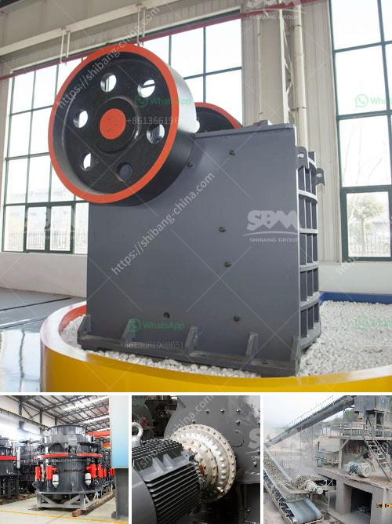

<h3>ball mill di philippines</h3>
Ball mill is the key equipment for grinding and crushing materials, which is widely used in the production line of cement, silicate, refractory, fertilizer, glass-ceramic and other powder industries. As the largest exporter of ball mill equipment in China, Xinhai Mining Machinery has been recognized by customers in the Philippines and other countries for more than 30 years. Recently, many foreign customers have inquired about the ball mill, and there is a growing trend in the Philippines.

The development of mining machinery and equipment is closely related to the economic and social development of the Philippines. Many mining enterprises have gradually introduced advanced technologies, which not only improves the production efficiency of mining enterprises, but also promotes the overall development of the Philippines' mining industry. As an important part of the mining machinery industry, the ball mill also plays an irreplaceable role in the development of the mining industry.

The ball mill produced by Xinhai Mining Machinery is the key equipment for grinding and crushing materials after receiving the crushed ore. It is widely used in cement, silicate products, new building materials, refractory materials, fertilizer, black and non-ferrous metal processing, glass ceramics and other industries. It can be used for dry or wet grinding of various ores and other materials.

Xinhai Mining Machinery has always focused on the research and development and innovation of ball mills. The ball mill produced by Xinhai Mining Machinery has been well received by customers in the Philippines and other countries. The main features of the ball mill are as follows:

1. High grinding efficiency: The grinding medium is in a throwing state, and the grinding efficiency is high.

2. Simple structure and easy operation: The ball mill adopts a simplified design, and the operation and maintenance are convenient.

3. Low investment and energy saving: The ball mill has a relatively low investment cost, and the energy-saving effect is remarkable. In the same production line, the ball mill can save electricity by 10-20%.

5. Wide application range: It can be used for grinding various ores and other materials, and is suitable for both dry and wet grinding.

In conclusion, the ball mill produced by Xinhai Mining Machinery has been widely recognized and favored by customers in the Philippines and other countries. With the continuous development of the mining industry, the ball mill will play a more and more important role in the production line. Xinhai Mining Machinery will continue to improve the technology and provide high-quality ball mill equipment to meet the needs of customers in the Philippines and other countries.
<h3>Contact us</h3><ul><li><strong>Whatsapp:&nbsp;<a href="https://wa.me/8613661969651">+8613661969651</a></strong></li><li><a href="https://swt.shibang-china.com/?git&amp;zhl&amp;ball mill di philippines"><strong>Online Service(chat now)</strong></a></li></ul><h3>Related</h3><ul><li><a href='crush stone machinery.md'>crush stone machinery</a></li><li><a href='ball mill procedure in practical.md'>ball mill procedure in practical</a></li><li><a href='jual stone crusher mobile cap 30 tph in indonesia.md'>jual stone crusher mobile cap 30 tph in indonesia</a></li><li><a href='pulverizer for carbon black.md'>pulverizer for carbon black</a></li><li><a href='stone crushers in ethiopia.md'>stone crushers in ethiopia</a></li></ul>