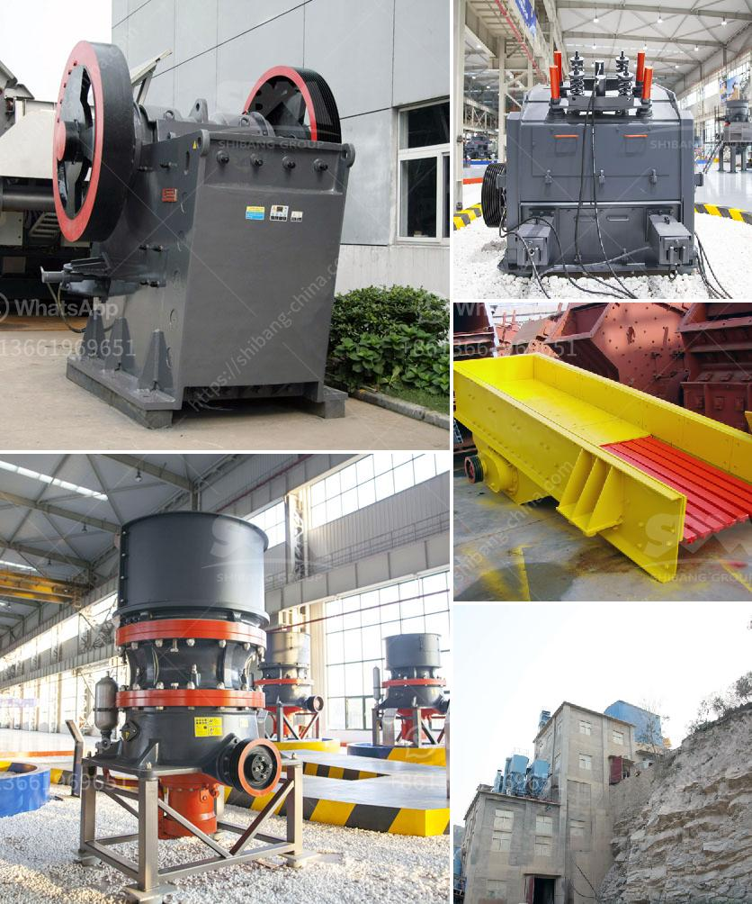

<h3>ball mill diagram for cement grinding</h3>
Ball mill diagram for cement grinding shows the standard configuration with the main components including a grinding chamber, motor, mill shell, and a diaphragm. This grinding chamber is filled with different types of grinding media such as balls or cylpebs that are transferred and cascaded within the chamber causing particle size reduction. As the material moves through the mill, it is subjected to impact and attrition forces, resulting in the formation of fine particles.

The motor in the ball mill diagram drives the cylinder rotating, which produces centrifugal force. This force brings the grinding media to a certain height and then falls down, impacting and grinding the material. The material inside the grinding chamber is continuously fed, and the ground particles are discharged through the diaphragm, ensuring a proper size distribution.

The mill shell in the diagram is cylindrical, and it rotates around its axis, providing a means of grinding the material. The shape and size of the mill shell may vary depending on the application and the desired output. It is typically made from steel, which ensures strength and durability.

In the ball mill diagram, various materials can be used as grinding media, including ceramic balls, flint pebbles, and stainless steel balls. The choice of grinding media depends on the hardness of the material being ground and the desired particle size distribution.

Cement grinding is an essential process in cement production, and the ball mill diagram provides a clear understanding of its operation. This grinding process is typically used in conjunction with other materials handling equipment, such as conveyors and bucket elevators, to ensure a smooth flow of material through the production line.

In conclusion, the ball mill diagram for cement grinding is a valuable reference tool that improves the understanding of the grinding process, as well as its efficiency and effectiveness. It provides insight into the principles of operation, key components, and the overall configuration of the mill. By understanding the diagram, operators can optimize the grinding process to achieve the desired product quality and production rate.
<h3>Contact us</h3><ul><li><strong>Whatsapp:&nbsp;<a href="https://wa.me/8613661969651">+8613661969651</a></strong></li><li><a href="https://swt.shibang-china.com/?git&amp;zhl&amp;ball mill diagram for cement grinding"><strong>Online Service(chat now)</strong></a></li></ul><h3>Related</h3><ul><li><a href='crushers of cone ethiopia.md'>crushers of cone ethiopia</a></li><li><a href='100 tph stone crusher plant specifications.md'>100 tph stone crusher plant specifications</a></li><li><a href='vrm vertical roller mill.md'>vrm vertical roller mill</a></li><li><a href='portable gold recovery mill for sale.md'>portable gold recovery mill for sale</a></li><li><a href='stone crushers in ethiopia.md'>stone crushers in ethiopia</a></li></ul>