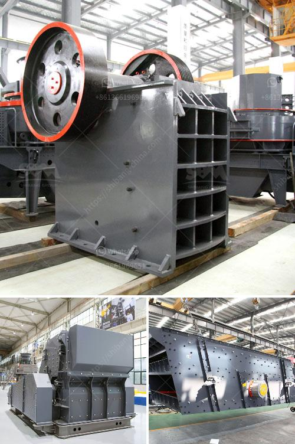

<h3>ball mill for sale south africa</h3>
The ball mill for sale in South Africa is a crucial piece of equipment in the mining industry. It plays a vital role in grinding ores and other materials into powder, making it one of the essential tools for mineral processing.

The ball mill can be used to grind different ores and other materials, such as coal, lime, cement, silica sand, iron ore, gold ore, glass, and ceramics, among others. It is widely used in industries such as cement, silicate products, new building materials, refractory materials, chemical fertilizers, black and non-ferrous metal beneficiation, and glass ceramics production.

One of the key advantages of a ball mill is its simple and reliable operation. The process involves feeding the material into the drum, where it is ground by the grinding media (steel balls or rods) in a rotating horizontal cylinder. The ground material is then discharged through the discharging system.

In addition to its efficiency and versatility, the ball mill is also known for its low maintenance and longevity. It is designed to withstand the harsh working conditions in the mining industry, ensuring continuous and reliable operation.

With the rise in demand for mineral products, including gold, platinum, manganese, and chrome, the ball mill for sale in South Africa has become more popular among investors. In fact, South Africa is currently one of the largest producers of gold, platinum, and chrome in the world.

If you are in the mining industry and looking for a reliable and efficient grinding solution, the ball mill for sale in South Africa is an excellent choice. It offers both small scale and large scale grinding options, catering to different production needs.

In conclusion, the ball mill for sale in South Africa has a bright future in the mining industry. It is reliable, efficient, and versatile, making it an indispensable piece of equipment for various mineral processing operations.
<h3>Contact us</h3><ul><li><strong>Whatsapp:&nbsp;<a href="https://wa.me/8613661969651">+8613661969651</a></strong></li><li><a href="https://swt.shibang-china.com/?git&amp;zhl&amp;ball mill for sale south africa"><strong>Online Service(chat now)</strong></a></li></ul><h3>Related</h3><ul><li><a href='how much to set up a granite crushing plant.md'>how much to set up a granite crushing plant</a></li><li><a href='jaw crusher grinding.md'>jaw crusher grinding</a></li><li><a href='crusher plant operator in crusher.md'>crusher plant operator in crusher</a></li><li><a href='prices for granite crushers.md'>prices for granite crushers</a></li><li><a href='silica sand washing plant in malaysia.md'>silica sand washing plant in malaysia</a></li></ul>