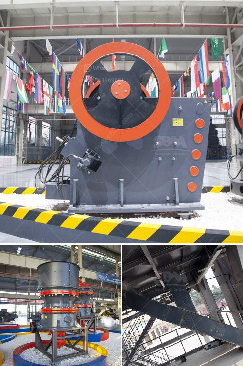

<h3>ball mill for solutions</h3>
The ball mill is a key equipment for grinding materials, widely used in powder-making production line such as cement, silicate sand, new-type building material, refractory material, fertilizer, ore dressing of ferrous metal and non-ferrous metal, glass ceramics, etc. Ball mill can grind various ores and materials with dry type or wet type.

One of the key benefits of the ball mill is its versatility. It can be applied to grind different materials, making it ideal for a wide range of industries. Aside from cement and mining, ball mills are also used in the pharmaceutical industry for the production of black powder, explosives, and even food products like chocolate.

One of the primary advantages of the ball mill is its simplicity. It requires only minor maintenance and routine inspection. Aside from that, it is also easy to operate, making it suitable for both beginners and experienced operators. Additionally, the ball mill can also handle relatively high moisture content materials, making it adaptable to various production conditions.

In terms of efficiency, the ball mill is considered to be one of the most energy-efficient grinding machines on the market. It consumes less energy compared to other grinding equipment, such as vertical roller mills or roller presses. This energy-saving feature makes it a popular choice for achieving the desired fineness in grinding operations.

Another benefit of the ball mill is its low noise emission. Compared to other grinding machines, such as the Raymond mill, the ball mill produces less noise, making it an ideal choice for operations where noise pollution is a concern.

The ball mill consists of a rotating cylindrical shell, partially filled with grinding media such as ceramic or metal balls. The product to be ground is added into the shell along with the grinding media. The rotation of the shell causes the grinding media to collide with and crush the product into finer particles.

Many factors can affect the efficiency of the ball mill, such as the quantity and size of grinding media, the size and density of the product particles, and the rotational speed of the shell. Therefore, it is important to optimize these variables to achieve the desired grinding efficiency.

In conclusion, the ball mill is an efficient grinding machine that can grind a wide range of materials. It offers numerous benefits over other grinding mills, making it a versatile and cost-effective option for many industries. Its simplicity, low noise emission, and energy efficiency add to its appeal, making it a popular choice for grinding operations. Whether it is for cement, mining, or food production, the ball mill offers a reliable and efficient solution.
<h3>Contact us</h3><ul><li><strong>Whatsapp:&nbsp;<a href="https://wa.me/8613661969651">+8613661969651</a></strong></li><li><a href="https://swt.shibang-china.com/?git&amp;zhl&amp;ball mill for solutions"><strong>Online Service(chat now)</strong></a></li></ul><h3>Related</h3><ul><li><a href='gold milling licence in zimbabwe.md'>gold milling licence in zimbabwe</a></li><li><a href='mobile vibrating screens for hire in south africa.md'>mobile vibrating screens for hire in south africa</a></li><li><a href='pakistan crusher machine complete.md'>pakistan crusher machine complete</a></li><li><a href='iron ore vibrator screen.md'>iron ore vibrator screen</a></li><li><a href='stone crusher supplier.md'>stone crusher supplier</a></li></ul>