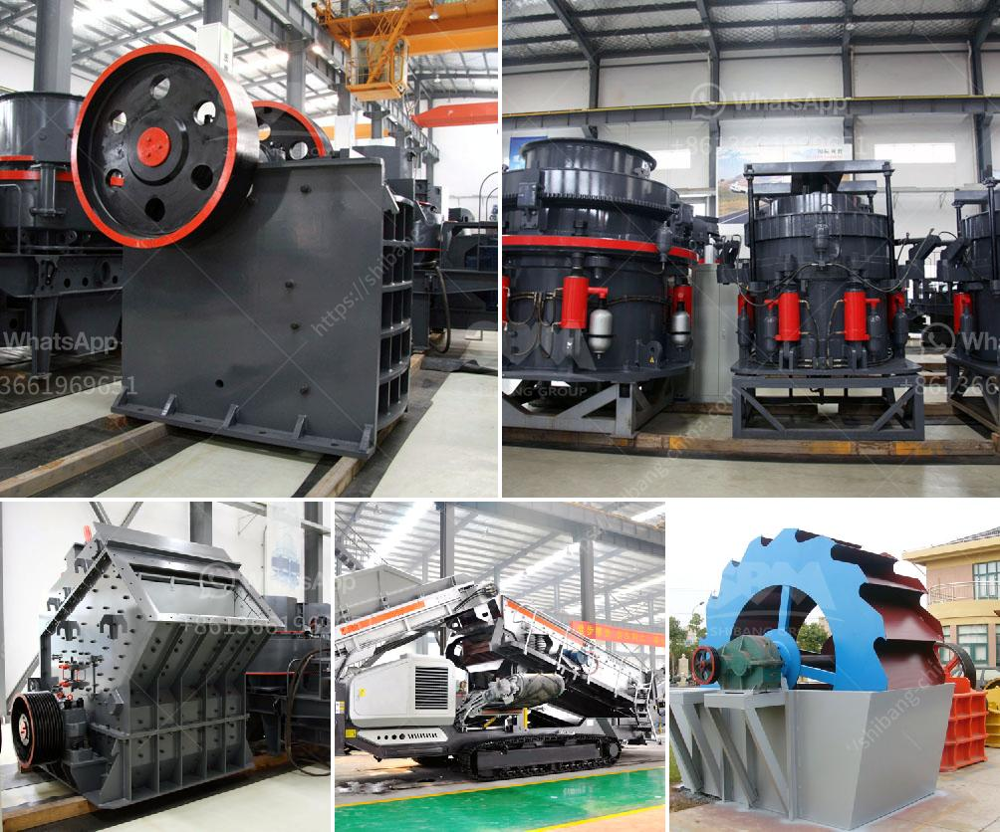

<h3>ball mill grinding mill</h3>
Ball mill grinding mill is an efficient tool for grinding many materials into fine powder. The Ball Mill is used to grind many kinds of mine and other materials, or to select the mine. It is widely used in building material, chemical industry, etc. There are two ways of grinding: the dry process and the wet process. It can be divided into tabular type and flowing type according to different forms of discharging material.

In recent years, the ball mill grinding mill has been widely used in the industry. This industry includes cement, new building materials, silicate, refractory materials, fertilizer, black and non-ferrous metal ore dressing and glass ceramics production industries, among which the dry ball mill grinding mill is widely favored by the market. 

The dry ball mill grinding mill is used to grind many kinds of mine and other materials, or to select the mine. Ball mill grinding mill is widely used in the cement industry, new building materials, refractory materials, fertilizer, ferrous and nonferrous metal processing and glass ceramics production industry, etc. It can grind various ores and other materials with dry type and wet type.

The ball mill grinding mill is made of medium carbon steel. It is a cylindrical device used to grind materials like ores, chemicals, ceramic raw materials and paints. The ball mill grinding mill rotates around a horizontal axis, partially filled with the material to be ground plus the grinding medium. Different materials are used as media, including ceramic balls, flint pebbles, and stainless steel balls. 

The ball mill grinding millis an efficient machine for grinding many materials into fine powder. Different grinding media are used for different grinding processes. The grinding of wet and dry materials is carried out in a grinding mill. The purpose of grinding is to grind the mined material into smaller particles. These smaller particles can be used for further processing of various materials.

The ball mill grinding mill has a simple structure and is easy to operate. The grinding medium in the grinding mill is mainly through the impact, crushing, grinding and squeezing of the material, and the grinding process is enhanced by the media. The grinding medium can be steel balls, steel bars, gravel or ore pebbles. The size of the grinding medium must be proportional to the size of the material being ground.

The ball mill grinding mill has high working efficiency, large processing capacity, and low energy consumption. It is an environmentally friendly equipment with low pollution and noise. The continuous improvement of equipment technology has also reduced the operating cost of the ball mill grinding mill and improved its production efficiency.

In conclusion, the ball mill grinding mill is an efficient tool for grinding many materials into fine powder. It has a wide range of applications in the industry and is favored by the market. With its simple structure, high working efficiency, and low energy consumption, it has become an essential equipment in various industries. Whether it is dry grinding or wet grinding, the ball mill grinding mill can meet the needs of different grinding processes.
<h3>Contact us</h3><ul><li><strong>Whatsapp:&nbsp;<a href="https://wa.me/8613661969651">+8613661969651</a></strong></li><li><a href="https://swt.shibang-china.com/?git&amp;zhl&amp;ball mill grinding mill"><strong>Online Service(chat now)</strong></a></li></ul><h3>Related</h3><ul><li><a href='quotation for minimum quary plant.md'>quotation for minimum quary plant</a></li><li><a href='business plan of silica sand crusher factory.md'>business plan of silica sand crusher factory</a></li><li><a href='pulverizer crusher machine manufacturers south africa.md'>pulverizer crusher machine manufacturers south africa</a></li><li><a href='business proposal sample for gold milling.md'>business proposal sample for gold milling</a></li><li><a href='micron grinding unit menufacture plant in bewar.md'>micron grinding unit menufacture plant in bewar</a></li></ul>