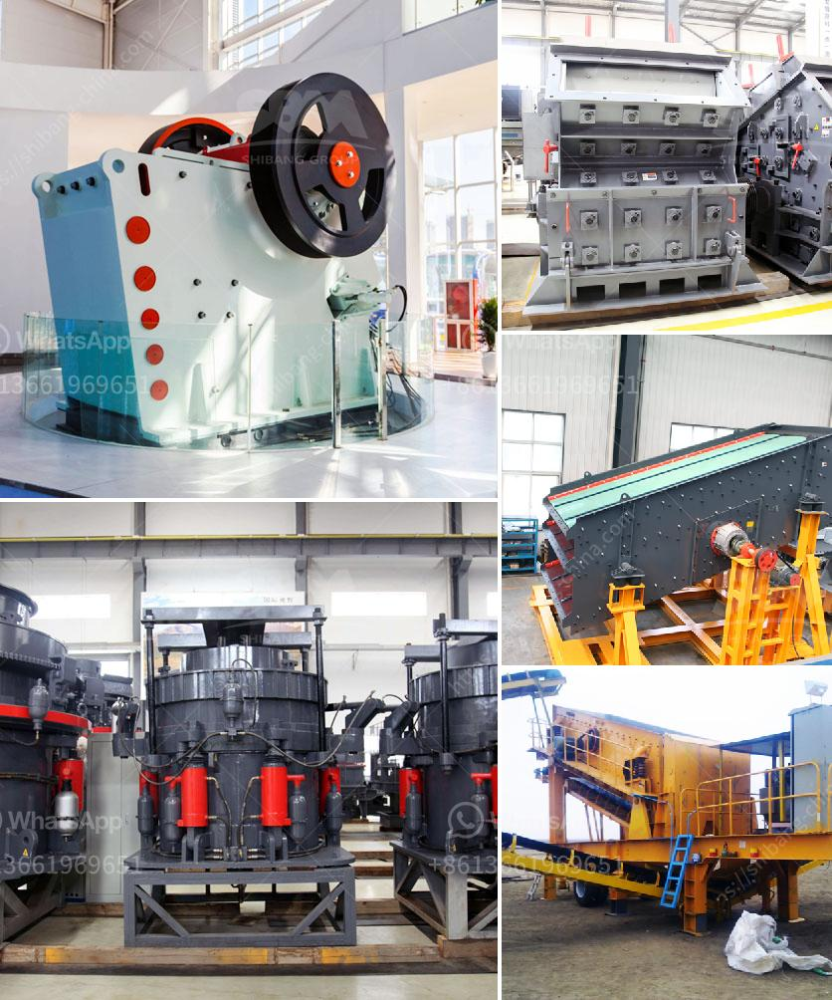

<h3>ball mill grinding relation with quality pdf</h3>
Ball mill grinding is a crucial process in the mining industry. In order to ensure the efficiency and quality of grinding, it is essential to consider several factors that affect the performance of the mill.

One of the key factors that influence the grinding quality is the residence time of the material in the mill. The longer the material stays in the mill, the finer the grinding will be. This is because longer residence time allows more time for the grinding media to interact with the material, resulting in a more efficient comminution process.

Another important factor is the size of the grinding media. The size of the media directly impacts the grinding efficiency and fineness of the material. Smaller media tend to generate finer particles, while larger media are more effective for coarse grinding. Therefore, selecting the appropriate media size is crucial for achieving the desired grinding quality.

Additionally, the speed of the mill also affects the grinding quality. Higher mill speeds generally result in finer grinding, while lower speeds may lead to coarser grinding. It is important to find the optimal speed that balances the desire for fine grinding with the need for efficient and productive operation.

Furthermore, the material being ground also plays a significant role in determining the grinding quality. Different materials have different hardness and grindability characteristics, which can affect the performance of the mill. It is important to understand the properties of the material and adjust the mill parameters accordingly to achieve the desired grinding quality.

In conclusion, several factors influence the grinding quality in a ball mill. The residence time, size of the grinding media, mill speed, and material properties all play important roles in determining the efficiency and fineness of grinding. Understanding and optimizing these factors are crucial for achieving high-quality grinding results in the mining industry.
<h3>Contact us</h3><ul><li><strong>Whatsapp:&nbsp;<a href="https://wa.me/8613661969651">+8613661969651</a></strong></li><li><a href="https://swt.shibang-china.com/?git&amp;zhl&amp;ball mill grinding relation with quality pdf"><strong>Online Service(chat now)</strong></a></li></ul><h3>Related</h3><ul><li><a href='stone crusher for sale in south africa.md'>stone crusher for sale in south africa</a></li><li><a href='metal crusher for rent.md'>metal crusher for rent</a></li><li><a href='granite gypsum quarry.md'>granite gypsum quarry</a></li><li><a href='list of crusher in bharatpur distric.md'>list of crusher in bharatpur distric</a></li><li><a href='material of mantles ball mills.md'>material of mantles ball mills</a></li></ul>