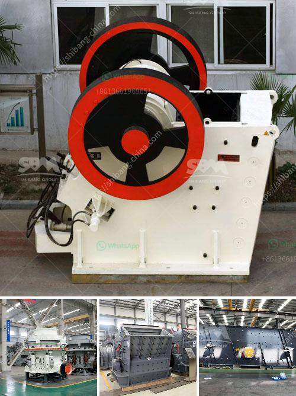

<h3>ball mill in china</h3>
China's manufacturing industry has been undergoing significant transformation over the past few decades. The nation's focus has shifted from low-cost mass production to high-quality, innovative manufacturing. As a result, numerous industrial sectors, including the ball mill industry, have witnessed remarkable growth. This article will explore the flourishing ball mill industry in China, offering a glimpse into its development and potential for future expansion.

The ball mill industry in China is believed to produce millions of tons of various ores and other materials every year. This booming market is expanding at a promising rate, creating ample opportunities for investment, innovation, and technological advancements.

Ball mills are mechanical devices used to grind or mix different materials, such as minerals, ores, chemicals, and ceramic raw materials. They serve a vital role in the manufacturing industry, where these mills are employed to reduce the particle size of a material to facilitate further processing. Ball mills are commonly used in the cement, mining, metallurgy, chemistry, ceramics, and construction sectors.

1. Robust Demand: China's booming construction industry has been a key driver of the ball mill market. Rapid urbanization, infrastructure development, and the government's focus on sustainable development have increased the need for high-quality construction materials, fostering the demand for ball mills.

2. Technological Advancements: China has witnessed remarkable strides in technological advancements, especially in the manufacturing sector. Advanced designs and improved operational efficiency of ball mills have significantly contributed to their popularity in the industry. Automation, computer control systems, and enhanced grinding capabilities have made Chinese ball mills highly desirable.

3. Strong Government Support: The Chinese government has been actively promoting and supporting the domestic manufacturing industry. Favorable policies, tax incentives, and financial aid schemes have encouraged local manufacturers to invest in R&D, leading to the development of high-quality ball mills.

The future of the ball mill industry in China is undoubtedly promising, given the nation's determination to establish itself as an innovative manufacturing hub. The following factors contribute to its promising prospects:

1. Increasing Exports: China's ball mill manufacturers are enjoying an increasing presence in various global markets, including the United States, Europe, and Australia.

2. Improved Environmental Sustainability: Ball mills in China are gradually incorporating eco-friendly measures, which ensure sustainable manufacturing practices. Energy-efficient mechanisms and waste management techniques are being implemented to reduce carbon emissions and minimize environmental impact.

1. Heightened Competition: The increasing number of domestic and international players poses a challenge for Chinese manufacturers, forcing them to constantly innovate and improve their product offerings.

2. Intellectual Property Protection: The protection of intellectual property rights remains a critical issue in the Chinese market. The risk of potential counterfeits and patent infringements poses a challenge for manufacturers who invest heavily in research and development.

The ball mill industry in China showcases a promising growth trajectory due to robust demand, technological advancements, and strong government support. Boasting high-quality designs, increased exports, and improved environmental sustainability, Chinese ball mills are set to conquer global markets while addressing challenges such as heightened competition and intellectual property protection. With continuous innovation and investments in research and development, the future of China's ball mill industry is poised for success.
<h3>Contact us</h3><ul><li><strong>Whatsapp:&nbsp;<a href="https://wa.me/8613661969651">+8613661969651</a></strong></li><li><a href="https://swt.shibang-china.com/?git&amp;zhl&amp;ball mill in china"><strong>Online Service(chat now)</strong></a></li></ul><h3>Related</h3><ul><li><a href='diamond mining machine in south africa.md'>diamond mining machine in south africa</a></li><li><a href='working of jaw crusher.md'>working of jaw crusher</a></li><li><a href='stone paper production machine.md'>stone paper production machine</a></li><li><a href='cone crusher for sale in philippines.md'>cone crusher for sale in philippines</a></li><li><a href='stone quarry companies in ghana.md'>stone quarry companies in ghana</a></li></ul>