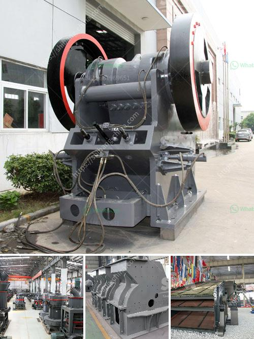

<h3>ball mill in wait of ball</h3>
The ball mill is widely used in the production of cement, silicate products, new building materials, refractory materials, fertilizers, black and non-ferrous metal dressings and glass ceramics, dry or wet grinding of various ores and other grindable materials. In the production line, there are multiple machines that can be used to grind materials, but the ball mill stands out due to its distinct features and advantages.

One of the main reasons why it is preferred in many industries is its ability to handle a wide range of materials. From soft to hard materials, the ball mill can grind them effectively and efficiently. This versatility allows it to be used in various production processes, making it a highly sought-after piece of equipment.

In addition to its versatility, the ball mill also excels in terms of its performance. Its cylindrical design, along with the use of grinding media such as ceramic balls or steel balls, ensures efficient grinding of materials. The rotation of the cylinder produces a cascading effect, resulting in the crushing and grinding of the materials. This leads to finer particles being produced, which are then used in the production of various products.

Another advantage of the ball mill is its low energy consumption. Compared to other grinding machines, the ball mill requires less energy to operate, making it cost-effective and energy-efficient. This is especially significant in industries where energy consumption plays a significant role in the overall production costs.

Furthermore, the ball mill offers a high level of automation, making it easier to control and operate. Modern ball mills are equipped with advanced control systems that allow operators to monitor and control various parameters such as the temperature, pressure, and speed of the mill. This automation not only improves productivity but also ensures consistent and high-quality output.

When it comes to the performance and efficiency of a ball mill, the size and type of the grinding media used also play a crucial role. Depending on the specific requirements of the production process, different types of grinding media, such as steel balls, ceramic balls, or cylpebs, can be used. The size of the grinding media also affects the final product size, with smaller media resulting in finer particles.

In conclusion, the ball mill is a versatile and efficient grinding machine that is capable of handling a wide range of materials. It offers numerous advantages, including its ability to grind materials effectively, low energy consumption, high level of automation, and versatility in terms of grinding media. As a result, the ball mill is widely used in various industries, making it an essential piece of equipment in many production processes.
<h3>Contact us</h3><ul><li><strong>Whatsapp:&nbsp;<a href="https://wa.me/8613661969651">+8613661969651</a></strong></li><li><a href="https://swt.shibang-china.com/?git&amp;zhl&amp;ball mill in wait of ball"><strong>Online Service(chat now)</strong></a></li></ul><h3>Related</h3><ul><li><a href='best china brand crushing plant.md'>best china brand crushing plant</a></li><li><a href='industrial application ball mill.md'>industrial application ball mill</a></li><li><a href='models of ball mills.md'>models of ball mills</a></li><li><a href='stone crusher prices.md'>stone crusher prices</a></li><li><a href='gypsum crusher manufacturing plant.md'>gypsum crusher manufacturing plant</a></li></ul>