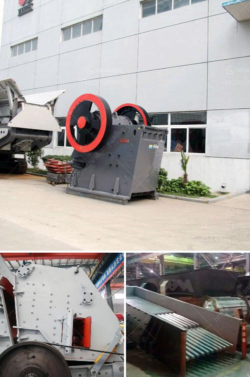

<h3>ball mill india</h3>
Ball mill is an efficient tool for grinding many materials into fine powder. The ball mill is used to grind many kinds of row materials. There are two ways of grinding: the dry process and the wet process. It can be divided into tubular type and flowing type according to different forms of discharging material.

Our Company has about three decades of involvement in manufacturing engineering equipment and has been operating as a machinery manufacturing company. We are reputed manufacturer and exporter of a premium quality range of Ball Mill India. Our company is known for producing Ball Mill in India, which is manufactured by using superior quality raw material, performance-based and robust construction for ensuring longer functional life. This equipment is designed with perfection, following stringent quality measures and specifications in order to meet the diverse requirements of clients. 

The ball mill is widely used in powder-making production line including cement, silicate, new-type building material, refractory material, fertilizer, ore dressing of ferrous metal and non-ferrous metal, glass ceramics, etc. 

To ensure the high efficiency operation of ball mill, it is necessary to perform the regular maintenance and keep a close eye on every aspect of the machine's performance. Failing to do so may result in unexpected breakdowns, loss of productivity, and higher repair costs.

It is recommended to hire professionals for the installation and maintenance of ball mills to ensure their safe and efficient operation. Professionals have the necessary skills, knowledge, and experience to identify and resolve any technical issues that may arise.

In conclusion, ball mills are an essential equipment in the mining industry and play a crucial role in the grinding and processing of various minerals. Being a highly significant piece of machinery, it is essential to ensure their proper functioning and maintenance. By investing in quality ball mills and hiring professionals for their installation and upkeep, industries can achieve optimal production and minimize downtime or unforeseen breakdowns.
<h3>Contact us</h3><ul><li><strong>Whatsapp:&nbsp;<a href="https://wa.me/8613661969651">+8613661969651</a></strong></li><li><a href="https://swt.shibang-china.com/?git&amp;zhl&amp;ball mill india"><strong>Online Service(chat now)</strong></a></li></ul><h3>Related</h3><ul><li><a href='stone crushing machinery suppliers.md'>stone crushing machinery suppliers</a></li><li><a href='mobile vibrating screens for hire in south africa.md'>mobile vibrating screens for hire in south africa</a></li><li><a href='best quartz crushing machine india.md'>best quartz crushing machine india</a></li><li><a href='stone mill hammer mill.md'>stone mill hammer mill</a></li><li><a href='application procedure for ball mill.md'>application procedure for ball mill</a></li></ul>