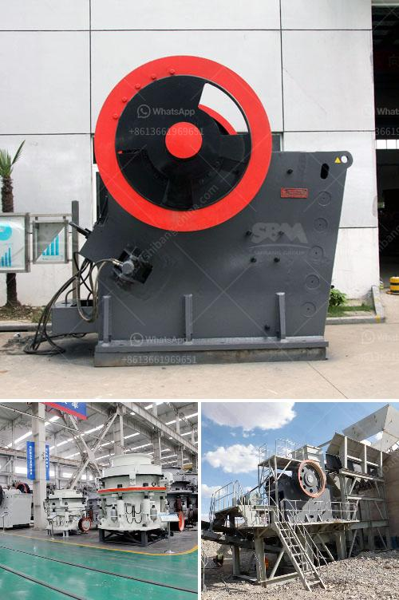

<h3>ball mill maintenance seminar</h3>
Ball mills are widely used in the mining industry, cement plants, power generation stations, etc. They are highly efficient grinding equipment that can grind various materials into fine powder. However, like any other heavy machinery, ball mills need regular maintenance and care to ensure optimal performance and longevity. To educate professionals and enhance their knowledge on proper ball mill maintenance, several seminars are being organized by industry experts around the world.

Ball mill maintenance seminars aim to teach participants how to perform regular maintenance on ball mills, identify and troubleshoot common problems, and optimize productivity and efficiency. Experienced instructors guide attendees through case studies, practical examples, and interactive discussions, providing participants with valuable knowledge and skills.

During the seminar, participants gain insights into various aspects of ball mill maintenance, including:

Understanding the function and importance of a proper lubrication system is crucial for maintaining efficient ball mill operation. Seminar attendees learn about different lubricants, their applications, and how to check and maintain the lubrication system to prevent damage to bearings and reduce downtime.

Regular mill inspection is essential to identify potential problems and prevent costly breakdowns. Attendees learn how to conduct an effective mill inspection, including inspection of liners, diaphragms, drive systems, and other critical components. They also learn techniques for optimizing mill performance and improving grinding efficiency.

Wear and tear are inevitable in ball mills due to constant grinding and material impact. Experts at the seminar demonstrate techniques for wear analysis, which helps identify specific areas requiring attention or repair. Participants learn about wear-resistant materials and coatings that can extend the lifespan of critical mill components.

Understanding common issues that arise in ball mills and knowing how to diagnose them is crucial for effective maintenance. Experts discuss common problems like vibration, overheating, gear failures, etc., and teach participants how to troubleshoot and address these issues promptly, preventing major disruptions and costly repairs.

Safety is of utmost importance in any industrial setting. The seminar emphasizes the importance of adhering to safety guidelines while performing maintenance tasks on ball mills. Participants learn about safety precautions, lockout/tagout procedures, and emergency protocols to ensure the well-being of personnel and equipment.

Ball mill maintenance seminars provide professionals with a valuable opportunity to enhance their knowledge and skills on maintaining ball mills effectively. By attending these seminars, participants gain a thorough understanding of various maintenance aspects, enabling them to optimize productivity, prevent costly breakdowns, and extend the lifespan of their equipment. In the ever-evolving industrial landscape, such seminars play a vital role in ensuring safe and efficient operation of ball mills, contributing to the overall success of mining, cement, and power generation industries.
<h3>Contact us</h3><ul><li><strong>Whatsapp:&nbsp;<a href="https://wa.me/8613661969651">+8613661969651</a></strong></li><li><a href="https://swt.shibang-china.com/?git&amp;zhl&amp;ball mill maintenance seminar"><strong>Online Service(chat now)</strong></a></li></ul><h3>Related</h3><ul><li><a href='how to calculate the operating cost of a stone crusher.md'>how to calculate the operating cost of a stone crusher</a></li><li><a href='quarry crusher price.md'>quarry crusher price</a></li><li><a href='large quarry machine manufacturers.md'>large quarry machine manufacturers</a></li><li><a href='vrm vertical roller mill.md'>vrm vertical roller mill</a></li><li><a href='ceramic crusher machine.md'>ceramic crusher machine</a></li></ul>