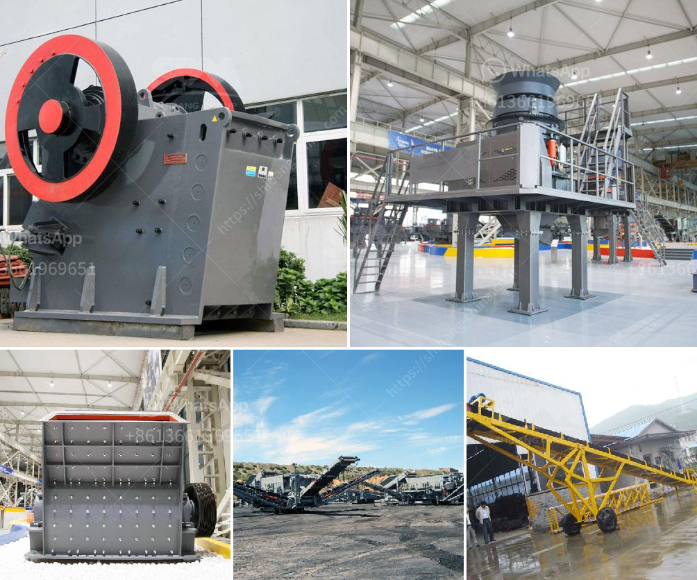

<h3>ball mill manufacturer india</h3>
Ball Mill Manufacturer India: A ball mill is a type of grinder used to grind and blend materials for use in various industries. It is widely used in cement, silicate products, new building materials, fertilizers, ceramics, glass, and other industries. There are two types of ball mill: dry and wet. As a leading manufacturer of ball mill in India, we have been adhering to the superior quality and low price principles to deliver our machines to various customers across the country.

India has a vast wealth of minerals, and ball mills play a crucial role in the extraction process. These mills are used to grind ore, coal, cement, and other materials into powder, which is required in various manufacturing industries. Our company is a reputable ball mill manufacturer India. It is a well-known fact that no country can develop without a robust manufacturing sector. And, India has taken several steps in recent years to improve its manufacturing capabilities. As a result, many international companies are now looking to Indian manufacturers for their requirements.

Our company specializes in the production of ball mills, which are a vital component in various industries. We have a team of experienced professionals who constantly strive to improve our machines' quality and functionality. Our machines are manufactured using high-quality materials and cutting-edge technology, ensuring their reliability and durability. With years of experience in the industry, we understand the unique requirements of our customers and provide them with tailor-made solutions.

One of the key factors that make our company a preferred choice among customers is our commitment to customer satisfaction. We believe in maintaining long-term relationships with our clients, and we achieve this by understanding their needs and providing them with the best possible solutions. Our team works closely with the customers, assisting them in selecting the right machine for their specific requirements. We also provide after-sales support, ensuring that our customers' machines operate smoothly and efficiently.

In addition to offering high-quality ball mill machines, we also provide customization services. Our customers can specify their requirements, and our team will manufacture a machine that meets their exact specifications. This ensures that our customers get a machine that perfectly suits their needs and delivers optimal performance. Moreover, customization also allows our customers to enhance their productivity by incorporating specific features into the machine.

Being a responsible ball mill manufacturer India, we strive to contribute to the country's overall growth. We firmly believe in the "Make in India" campaign and actively participate in various initiatives to promote indigenous manufacturing. As a part of our corporate social responsibility, we also take steps to minimize our environmental impact. We adhere to eco-friendly manufacturing practices and strive to reduce waste generation and energy consumption.

In conclusion, our company is a reputed ball mill manufacturer India with a strong customer base. We provide high-quality machines at competitive prices, and our commitment to customer satisfaction has earned us a distinguished position in the market. With our expertise and reliable machines, we aim to contribute to India's growth and become a leading player in the global manufacturing sector.
<h3>Contact us</h3><ul><li><strong>Whatsapp:&nbsp;<a href="https://wa.me/8613661969651">+8613661969651</a></strong></li><li><a href="https://swt.shibang-china.com/?git&amp;zhl&amp;ball mill manufacturer india"><strong>Online Service(chat now)</strong></a></li></ul><h3>Related</h3><ul><li><a href='hp cone crusher device.md'>hp cone crusher device</a></li><li><a href='zircon sand supplier in singapore.md'>zircon sand supplier in singapore</a></li><li><a href='mobile crusher in saudi arabia.md'>mobile crusher in saudi arabia</a></li><li><a href='sample of project proposal in mining.md'>sample of project proposal in mining</a></li><li><a href='price of gypsum processing plant.md'>price of gypsum processing plant</a></li></ul>