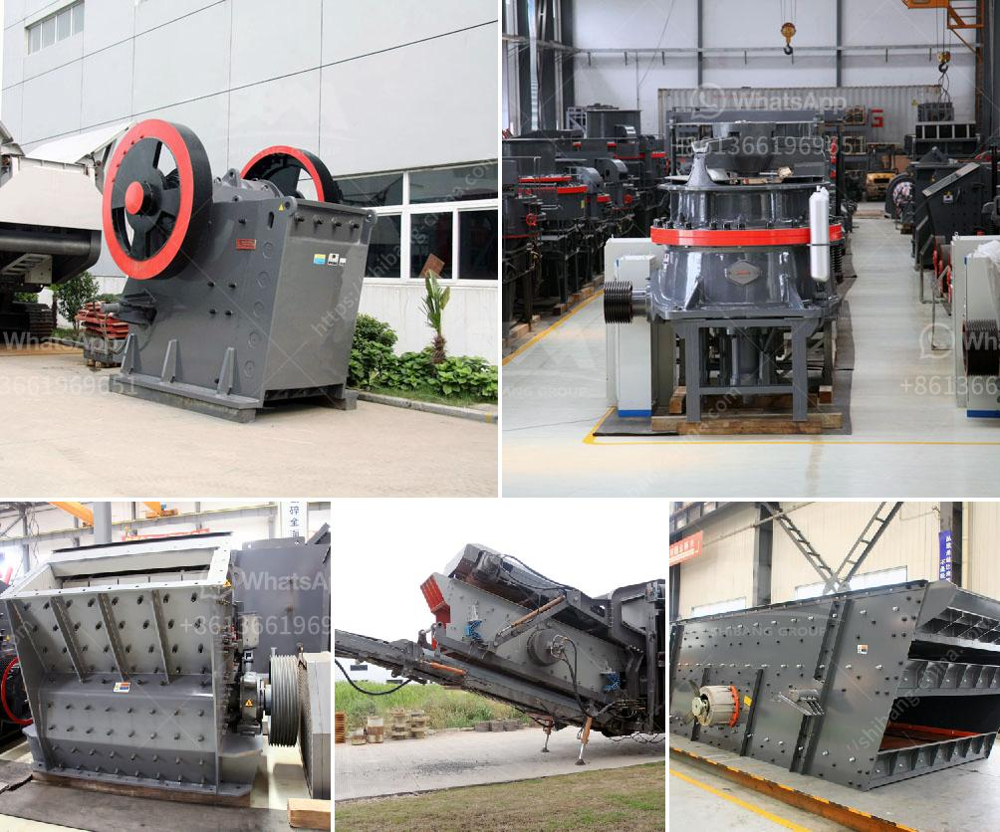

<h3>ball mill manufacturers coimbatore</h3>
Coimbatore is a bustling city in the Indian state of Tamil Nadu. The city is known for its industrial activities, especially in the textile and engineering sectors. One of the prominent industries in Coimbatore is the manufacturing of machinery and equipment. In this article, we will focus on one such machinery known as the ball mill.

A ball mill is a type of grinder used to grind materials into extremely fine powder for use in mineral dressing processes, paints, pyrotechnics, and ceramics. This efficient grinding tool is capable of grinding various types of materials into fine powder. They are commonly used in the mining industry, where they are used to grind ores and minerals into smaller particles for further processing.

In Coimbatore, several ball mill manufacturers are renowned for their expertise in crafting highly efficient and durable machines. Notable among these is Netzsch Grinding & Dispersing, which has been manufacturing cutting-edge equipment for the mineral processing industry for more than four decades now.

The company's ball mill models are perfectly suited for use in various types of industries including paints, pyrotechnics, and ceramics. Among other innovations, their distinctive design features continuously monitored cooling water and temperature control systems. These advancements ensure the efficiency and safety of their equipment.

Another leading industrial machinery manufacturer in Coimbatore is Tipco Engineering Works. With several years of experience in the field, they are known for their range of advanced ball mills engineered to meet the specific demands of diverse industries. Tipco Engineering Works has been able to gain significant trust from its customers due to its commitment to quality and durability.

Apart from producing high-quality ball mills, these manufacturers also offer a variety of other machinery such as sand mill, high-speed disperser, and more. These machines are used in various industries such as chemical, pharmaceutical, construction, cement, and others.

The grinding process is a significant part of the entire manufacturing process in industries, and hence the efficiency and quality of ball mills directly affect the production efficiency and output of the plant. Hence, several industries rely on ball mills for their grinding needs.

To conclude, Coimbatore's ball mill manufacturers are known for their high-quality ball mills that are suitable for various industrial applications. These are precisely manufactured by the skilled professionals who have in-depth knowledge of their production. The robustness, durability, and efficiency of their machines are highly appreciated in the market. So, if you are searching for the best ball mill manufacturers in Coimbatore, give your due consideration to the aforementioned manufacturers.
<h3>Contact us</h3><ul><li><strong>Whatsapp:&nbsp;<a href="https://wa.me/8613661969651">+8613661969651</a></strong></li><li><a href="https://swt.shibang-china.com/?git&amp;zhl&amp;ball mill manufacturers coimbatore"><strong>Online Service(chat now)</strong></a></li></ul><h3>Related</h3><ul><li><a href='dolomite production.md'>dolomite production</a></li><li><a href='operation hammer mill.md'>operation hammer mill</a></li><li><a href='gold refinery equipment china.md'>gold refinery equipment china</a></li><li><a href='mobile crusher in saudi arabia.md'>mobile crusher in saudi arabia</a></li><li><a href='material of sectional conveyor belts.md'>material of sectional conveyor belts</a></li></ul>