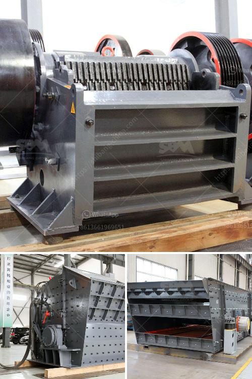

<h3>ball mill manufacturers south africa</h3>
With the continual development of the South African economy, the expansion of the mining industry and the improvement of infrastructure provide a good market for ball mill manufacturers in South Africa. In recent years, there has been a significant increase in the demand for a wide range of ball mills in South Africa, which is also reflected in the increase in the production of different ball mill manufacturers.

South Africa is renowned for its gold, diamond, platinum and other mineral resources, accounting for a significant proportion of the world's production. In addition, South Africa's coal-based energy system is also a major contributor to global carbon dioxide emissions, ranking among the top 20 countries in terms of total emissions. Therefore, the development of renewable energy is of great significance to South Africa. In this case, ball mills are widely utilized to grind ores and minerals to meet the requirements of ore beneficiation and power generation plants.

South Africa's mineral resources are mainly gold, platinum group metals, manganese, vanadium, chromium, silicon aluminum ore, iron ore and coal, etc. Among them, the gold reserves in South Africa account for 56.2% of the world's total gold reserves. South Africa is the world's largest gold producer, accounting for approximately 15% of global gold production. Ball mills are widely used in this country, and there are also many manufacturers.

Ball mill manufacturers in South Africa make various grinding balls and grinding media ball mills and rod mills are suitable for grinding all kinds of ores and other materials that are widely used in mineral processing, building materials and chemical industries. There are two grinding methods: dry grinding and wet grinding. Dry grinding can achieve ultra-fine pulverization, and wet grinding is suitable for mixing and dispersing materials.

The ball mill produced by Fote Machinery shows good casting process performance, high mechanical properties, and good heat treatment performance to minimize the wear during materials impacting. The grinding balls are mainly made of high manganese steel, it makes ball mill balls good toughness, good manufactory technical and manufacturing processes to improve the service life of grinding balls.

As a professional ball mill manufacturer, Fote Machinery provides a comprehensive range of ball mill maintenance services, including installation guidance, required spare parts, as well as technical support and services from the experts. We also provide customized turnkey solutions to meet various production needs. Our ball mills have been exported to many countries, such as India, South Africa, Tanzania, Nigeria, Indonesia, Iran, Chile, Brazil, Russia, Algeria, Ghana, and more.

Fote Machinery supplies ball mill drives with speeds ranging from low-speed synchronous motors to high-speed motor and gearbox combinations. Each ball mill comes complete with an advanced control system that monitors the balls' positions inside the mill to ensure optimal grinding efficiency. In addition, the system can remotely control the ball mill from the central control room, reducing manpower and improving operating efficiency.

In conclusion, ball mill manufacturers in South Africa should improve production technology, reduce construction costs, and improve profitability to maximize the development of the South African mining industry.
<h3>Contact us</h3><ul><li><strong>Whatsapp:&nbsp;<a href="https://wa.me/8613661969651">+8613661969651</a></strong></li><li><a href="https://swt.shibang-china.com/?git&amp;zhl&amp;ball mill manufacturers south africa"><strong>Online Service(chat now)</strong></a></li></ul><h3>Related</h3><ul><li><a href='smallest cement plant.md'>smallest cement plant</a></li><li><a href='granite crusher processing machines south africa.md'>granite crusher processing machines south africa</a></li><li><a href='used stone cutting machine from japan.md'>used stone cutting machine from japan</a></li><li><a href='mobile crusher sale germany.md'>mobile crusher sale germany</a></li><li><a href='manufacturing of talcum powder.md'>manufacturing of talcum powder</a></li></ul>