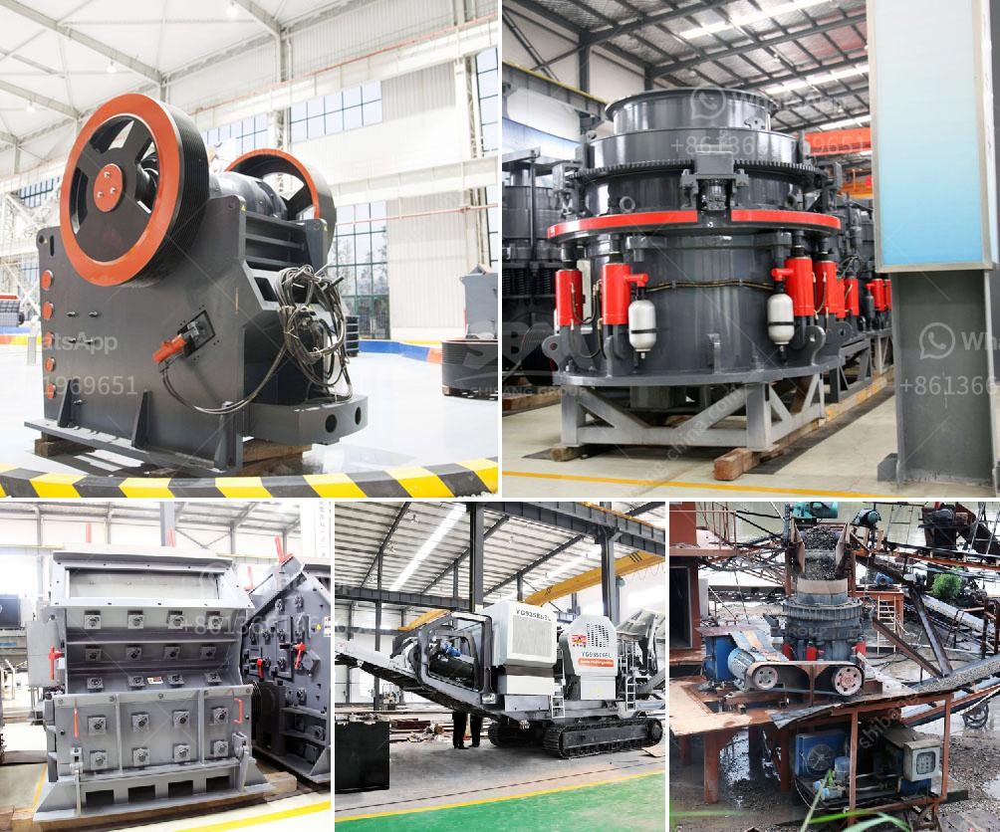

<h3>ball mill mexico</h3>
The ball mill is one of the most widely used grinding machines in the mining industry. With its simple design and ease of operation, the ball mill has become a staple in the mining industry. In Mexico, the ball mill is also a common machine in the mining industry.

Mexico is known for its diverse minerals resources, which are spread throughout the country. The country's mineral wealth includes deposits of gold, silver, zinc, copper, lead, iron ore, and many others. In order to extract these valuable resources, mining companies in Mexico rely heavily on the ball mill.

The ball mill is a crucial piece of equipment for grinding crushed materials into fine powder. The main components of a typical ball mill include a rotating drum filled with grinding media (such as balls), a motor, and a grinding chamber. The drum is usually lined with abrasion-resistant material, such as manganese steel or rubber, to prevent excessive wear and tear.

The grinding media in the ball mill are typically steel or ceramic balls of varying sizes, depending on the desired particle size of the final product. The grinding media crushes and grinds the material inside the drum, creating a fine powder. This powder is then collected and used in various industrial processes, including mineral processing, cement production, and pharmaceuticals.

One of the advantages of using a ball mill in Mexico is its versatility. The ball mill can grind a wide range of materials, from hard and brittle substances to soft and fibrous ones. This makes it suitable for a variety of applications, including grinding ores, chemicals, ceramics, and glass.

In Mexico, the ball mill is commonly used in the mining industry to grind materials in ore beneficiation plants. The size of the grinding media and the type of lining in the ball mill can significantly influence the final product size and shape. Therefore, careful selection of the grinding media and lining materials is crucial to ensure optimal grinding performance.

The ball mill in Mexico is typically powered by low-speed synchronous motors or high-speed motors coupled with gearboxes. The motors provide the necessary torque to rotate the drum at a controlled speed, allowing for efficient grinding of the materials.

In recent years, there has been a growing trend towards using ball mills in Mexico for environmentally friendly grinding processes. Some ball mills are equipped with advanced technologies, such as variable-speed drives and advanced control systems. These technologies help optimize the grinding process, reduce energy consumption, and minimize environmental impact.

In conclusion, the ball mill plays a crucial role in the mining industry in Mexico, where it is commonly used for grinding various materials into fine powder. Investing in efficient and environmentally friendly ball mill technology can significantly improve the performance of mining operations and contribute to sustainable development in the country.
<h3>Contact us</h3><ul><li><strong>Whatsapp:&nbsp;<a href="https://wa.me/8613661969651">+8613661969651</a></strong></li><li><a href="https://swt.shibang-china.com/?git&amp;zhl&amp;ball mill mexico"><strong>Online Service(chat now)</strong></a></li></ul><h3>Related</h3><ul><li><a href='dolomite crushers for sale.md'>dolomite crushers for sale</a></li><li><a href='chrome washing plant for sale.md'>chrome washing plant for sale</a></li><li><a href='how to start a rock quarry business.md'>how to start a rock quarry business</a></li><li><a href='gypsum board plant in richmond hill.md'>gypsum board plant in richmond hill</a></li><li><a href='clay crusher processing in india.md'>clay crusher processing in india</a></li></ul>