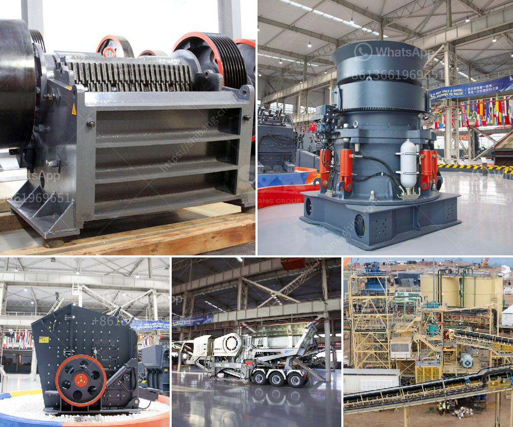

<h3>ball mill of small size</h3>
The ball mill is the key equipment for grinding materials after crushing. It is widely used in the production of cement, silicate products, new building materials, refractory materials, fertilizers, black and non-ferrous metal dressings and glass ceramics, dry or wet grinding of various ores and other grindable materials.

There are two types of ball mills: intermittent ball mills and continuous ball mills. The former is popular for small batch grinding or experimental grinding, while the latter is often used for industrial production due to its large processing capacity. However, in recent years, small-sized ball mills have gained popularity among researchers, small-scale miners, and hobbyists.

Small-sized ball mills typically have a cylindrical container filled with grinding balls, such as ceramic, steel, or lead balls. The grinding balls are usually contained within the container's walls and rotate with the container around its axis, causing the grinding media to collide and reduce the size of the material particles.

One advantage of small-sized ball mills is their portability and ease of use. Unlike larger industrial ball mills, small-sized ball mills can be moved around easily and stored in a compact space. This makes them suitable for small-scale mining operations or for those who need a ball mill for occasional use, such as hobbyists or researchers in the field of material science.

Small-sized ball mills are also more cost-effective compared to their larger counterparts. They require fewer materials and consume less energy to operate. This means that not only is the initial investment lower, but also the operational costs are reduced, making small-sized ball mills a more affordable option for those on a tight budget.

Despite their small size, these ball mills can still achieve high grinding efficiency. The compact design and robust construction of small-sized ball mills allow for the effective crushing and grinding of materials. The rotation speed and the material filling ratio inside the ball mill can be adjusted to ensure optimal grinding conditions, thus maximizing the grinding efficiency and reducing the grinding time required.

However, it is essential to note that small-sized ball mills have certain limitations. Due to their small capacity, they may not be suitable for large-scale industrial production. If the production volume is too high, it is more practical to use larger ball mills. Additionally, small-sized ball mills may have limitations in terms of the maximum feed size and the size of the final product, which can affect the overall efficiency and the quality of the grind.

In conclusion, small-sized ball mills are a versatile and cost-effective option for grinding and reducing material particles. They are portable, easy to use, and suitable for small-scale operations or occasional use. However, it is crucial to consider the specific requirements and limitations of small-sized ball mills before making a purchasing decision. Ultimately, finding the right ball mill size and type depends on various factors such as the desired production capacity, the nature of the material being processed, and the available budget.
<h3>Contact us</h3><ul><li><strong>Whatsapp:&nbsp;<a href="https://wa.me/8613661969651">+8613661969651</a></strong></li><li><a href="https://swt.shibang-china.com/?git&amp;zhl&amp;ball mill of small size"><strong>Online Service(chat now)</strong></a></li></ul><h3>Related</h3><ul><li><a href='rock crusher unit.md'>rock crusher unit</a></li><li><a href='latest three roll mills.md'>latest three roll mills</a></li><li><a href='sand screening mobile washing plants for sale.md'>sand screening mobile washing plants for sale</a></li><li><a href='rotary kilns in indonesia.md'>rotary kilns in indonesia</a></li><li><a href='gold crushers sale.md'>gold crushers sale</a></li></ul>